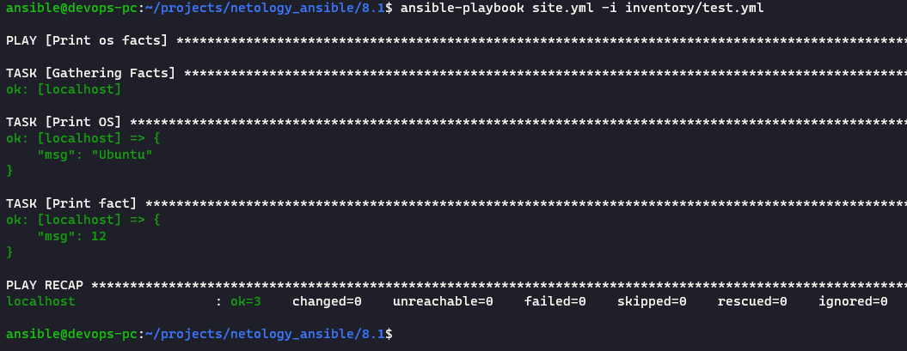
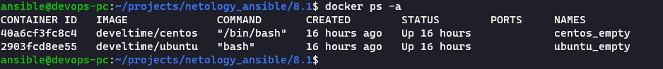
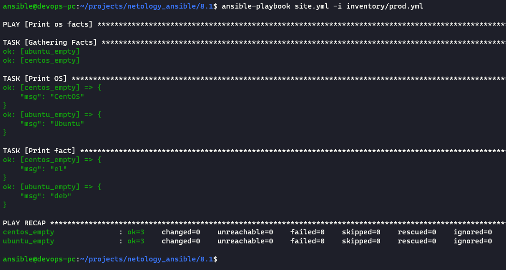
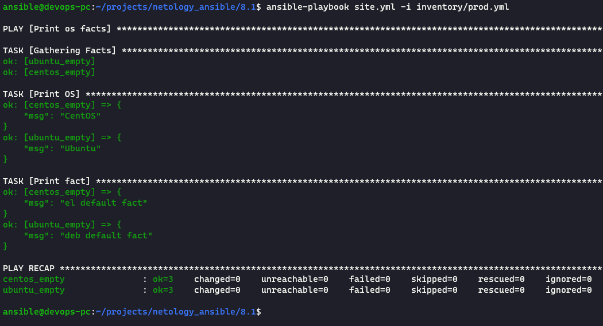
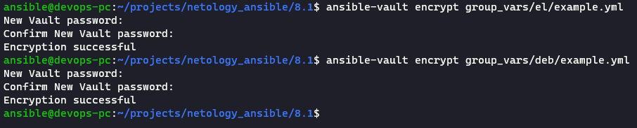
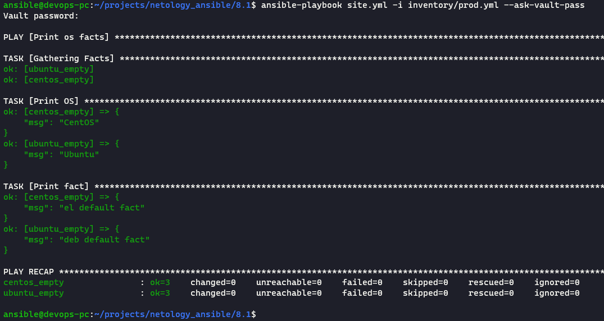
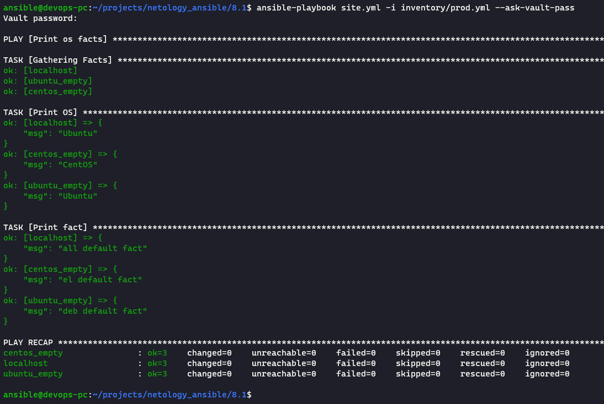

# Домашнее задание к занятию "8.1 Введение в Ansible"

## [Ansible playbook repository](https://github.com/develtime/ansible/tree/main/8.1)

1. `ansible-playbook site.yml -i inventory/test.yml`
   
   

2. [all default facts](https://github.com/develtime/ansible/blob/main/8.1/group_vars/all/example.yml#L2)
3. docker
   
   

4. `ansible-playbook site.yml -i inventory/prod.yml`
   
   

5. [deb default fact](https://github.com/develtime/ansible/blob/main/8.1/group_vars/deb/example.yml#L2) и [el default fact](https://github.com/develtime/ansible/blob/main/8.1/group_vars/el/example.yml#L2)

6. `ansible-playbook site.yml -i inventory/prod.yml`
   
   

7. Шифрование фактов
   
   

8. `ansible-playbook site.yml -i inventory/prod.yml --ask-vault-pass`
   
   

9. `local     execute on controller`
10. [prod local](https://github.com/develtime/ansible/blob/main/8.1/inventory/prod.yml#L11)
11. `ansible-playbook site.yml -i inventory/prod.yml --ask-vault-pass`
    
    
12. [playbook](https://github.com/develtime/ansible/tree/main/8.1)