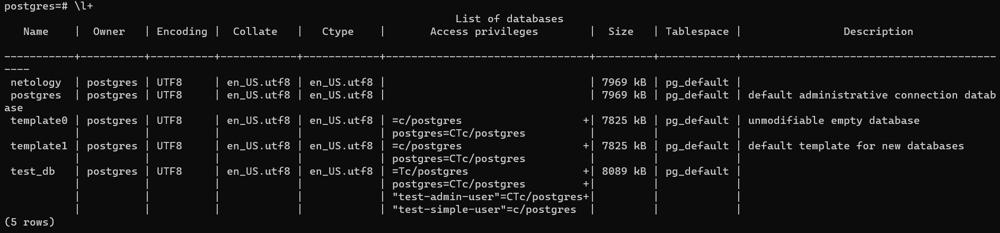
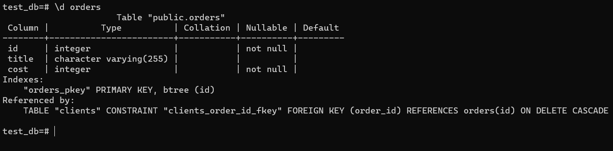
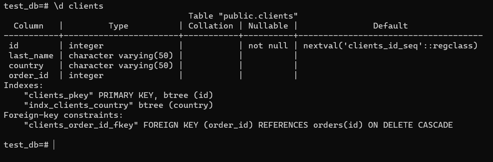
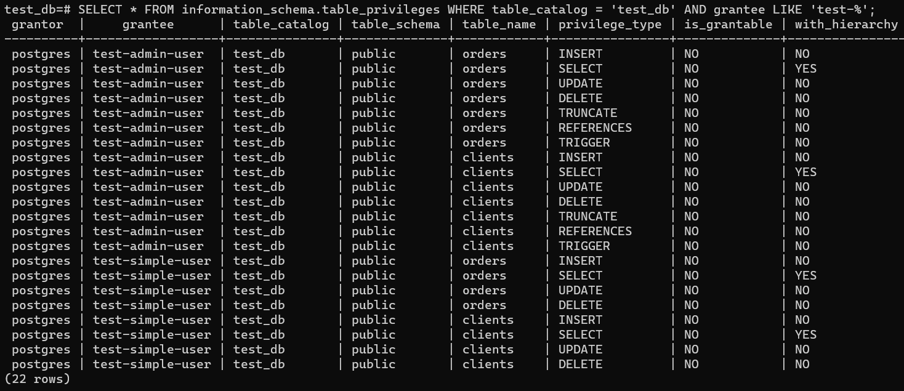
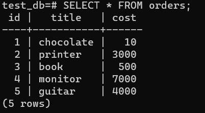
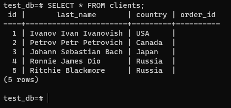
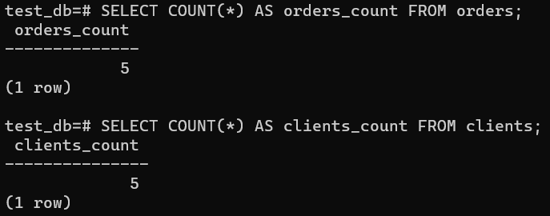
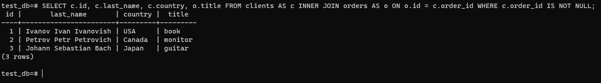
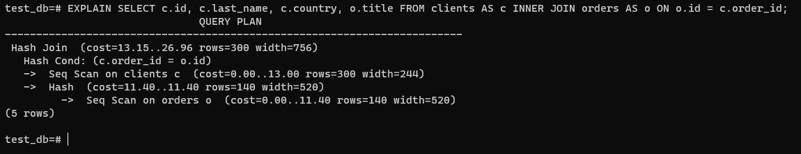

# Домашнее задание к занятию "6.2. SQL"

1. PostgreSQL v12.7 c 2 volume:

   ```yaml
   version: "3.3"
   services:
   db:
     image: postgres:12.7-alpine
     container_name: postgres_netology
     ports:
       - 5432:5432
     volumes:
       - /opt/data/pg_data:/var/lib/postgresql/data
       - /opt/data/pg_backups:/var/lib/postgresql/backups
     environment:
     POSTGRES_PASSWORD: postgres
     POSTGRES_USER: postgres
     POSTGRES_DB: netology
     PGDATA: /var/lib/postgresql/data/pgdata
     restart: always
   ```

2. Информация о БД и пользователях:

   ```sql
   CREATE DATABASE test_db;
   CREATE USER "test-admin-user" WITH ENCRYPTED PASSWORD '123';
   CREATE TABLE orders (id INT PRIMARY KEY, title VARCHAR(255), cost INT NOT NULL);
   CREATE TABLE clients (id SERIAL PRIMARY KEY, last_name VARCHAR(50), country VARCHAR(50), order_id INT REFERENCES orders(id) ON DELETE CASCADE);
   CREATE INDEX indx_clients_country ON clients (country);
   GRANT CONNECT ON DATABASE test_db to "test-admin-user";
   GRANT ALL ON ALL TABLES IN SCHEMA public to "test-admin-user";
   GRANT CONNECT ON DATABASE test_db to "test-simple-user";
   GRANT SELECT, INSERT, UPDATE, DELETE ON ALL TABLES IN SCHEMA public to "test-simple-user";
   ```

   

   

   

   ```sql
   SELECT * FROM information_schema.table_privileges WHERE table_catalog = 'test_db' AND grantee LIKE 'test-%';
   ```

   

3. Запись данных:

   ```sql
   INSERT INTO orders (id, title, cost) VALUES (1, 'chocolate', 10), (2, 'printer', 3), (3, 'book', 500), (4, 'monitor', 7), (5, 'guitar', 4
   );
   ```

   ```sql
   INSERT INTO clients (last_name, country) VALUES ('Ivanov Ivan Ivanovish', 'USA'), ('Petrov Petr Petrovich', 'Canada'), ('Johann Sebastian Bach', 'Japan'), ('Ronnie James Dio', 'Russia'), ('Ritchie Blackmore', 'Russia');
   ```

   

   

   ```sql
   SELECT COUNT(*) AS orders_count FROM orders;
   SELECT COUNT(*) AS clients_count FROM clients;
   ```

   

4. Добавление связей `clients\orders`:

   ```sql
   UPDATE clients SET order_id = 3 WHERE last_name = 'Ivanov Ivan Ivanovish';
   UPDATE clients SET order_id = 4 WHERE last_name = 'Petrov Petr Petrovich';
   UPDATE clients SET order_id = 5 WHERE last_name = 'Johann Sebastian Bach';
   ```

   ```sql
   SELECT c.id, c.last_name, c.country, o.title FROM clients AS c INNER JOIN orders AS o ON o.id = c.order_id;
   ```

   

5. Информация по выполнению запроса:

   

   `EXPLAIN` - выводит план построения запроса, как видно на скрине, `PostgreSQL` разделил запрос на 5 итераций, в каждой из которых мы можем видеть:

   - Приблизительное время котрое пройдет прежде чем начнется вывод данных, стоимость запуска;
   - Так называемая общая стоимость, приблизительное время которое понадобится на вывод всех данных (без учета прерывания вывода родительским узлом);
   - Ожидаемое число строк;
   - Ожидамый средний размер строк в байтах.

   Так же мы можем видеть, что в план входит соединение по хешу, при этом строки первой табилицы будут записаны в па хэш таблицу в памяти, затем сверены в другой таблицой

6. Бэкап и восстановление данных:

   ```sh
   pg_dump -U postgres -W test_db > /var/lib/postgresql/backups/test_db.sql
   ```

   ```sh
   psql -U postgres -W < /var/lib/postgresql/backups/test_db.sql
   ```
