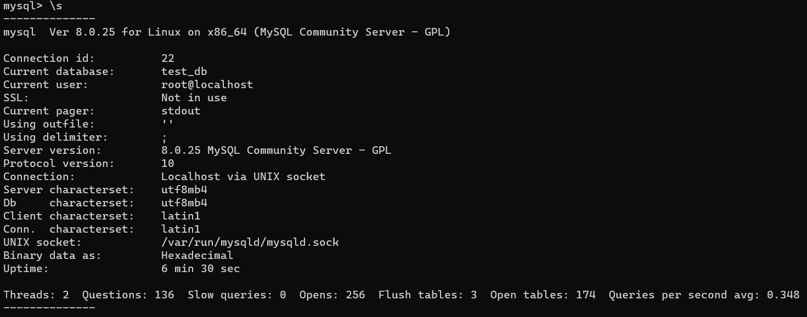
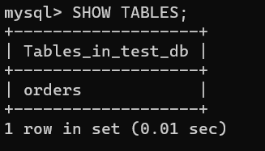
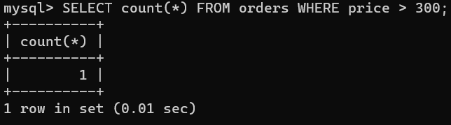
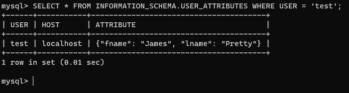
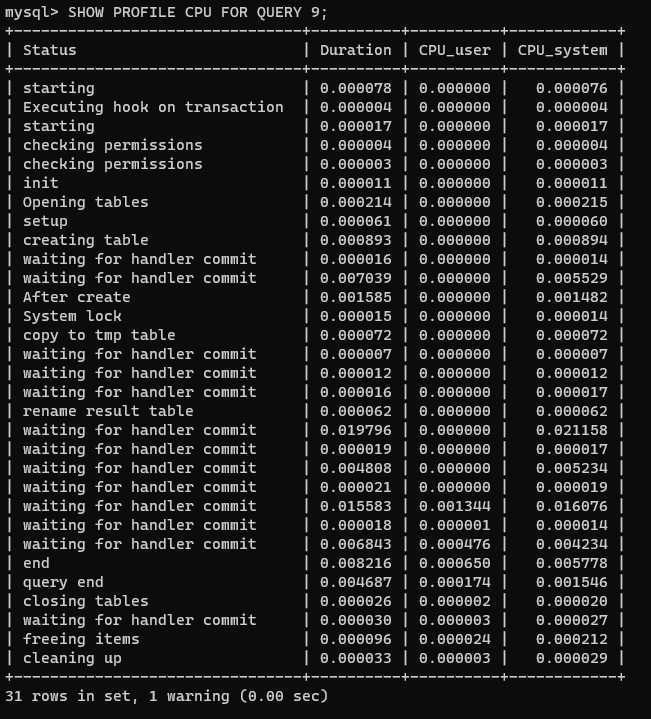

# Домашнее задание к занятию "6.3. MySQL"

1. MySQL 8.0.25

   ```yml
   version: "3.3"
   services:
   db:
     image: mysql:8.0
     container_name: mysql_netology
     command: --default-authentication-plugin=mysql_native_password
     ports:
       - 3306:3306
     volumes:
       - /opt/data/mysql_data:/var/lib/mysql
       - /opt/data/mysql_conf:/etc/mysql/conf.d
       - /opt/data/mysql_backup:/opt/mysql_backups
     environment:
     MYSQL_ROOT_PASSWORD: password
     restart: always

   adminer:
     image: adminer
     container_name: mysql_adminer
     restart: always
     ports:
       - 8080:8080
   ```

   

   

   

2. Тестовый пользователь

   

3. Смена движка

   ```sql
   ALTER TABLE orders ENGINE = MyISAM;
   ```

   

4. Конфигурация `my.cnf`

   ```ini
   [mysqld]

   # === InnoDB Settings ===

   innodb_file_per_table = ON

   innodb_log_buffer_size = 1M

   innodb_flush_method = O_DSYNC
   innodb_flush_log_at_trx_commit = 2

   # 30% of RAM
   innodb_buffer_pool_size = 683M
   innodb_log_file_size = 50M
   ```
