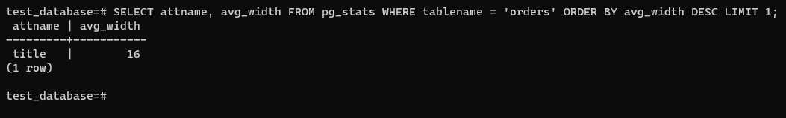

# Домашнее задание к занятию "6.4. PostgreSQL"

1.  PostgreSQL 13.3

    ```yaml
    version: "3.3"
    services:
    db:
      image: bitnami/postgresql:13.3.0
      container_name: postgresql_netology
      ports:
        - 5432:5432
      volumes:
        - /opt/data/postgresql_data:/bitnami/postgresql
        - /opt/data/postgresql_backup:/opt/postgresql_backups
      environment:
        - POSTGRESQL_PASSWORD=password
      restart: always
    ```

    Команды:

    - `\l` вывода списка БД
    - `\c` подключения к БД
    - `\d` вывода списка таблиц
    - `\d <table_name>` вывода описания содержимого таблиц
    - `\q` выхода из psql

2.  Нахождение столбца с наибольшим средним значением в байтах:

    ```sql
    SELECT attname, avg_width FROM pg_stats WHERE tablename = 'orders' ORDER BY avg_width DESC LIMIT 1;
    ```

    

3.  Шардирование таблицы `orders`:

    Для уже существующей таблицы:

    ```sql
     BEGIN TRANSACTION;
     CREATE TABLE orders_1 (CONSTRAINT price_1 CHECK (price > 499)) INHERITS (orders);
     CREATE TABLE orders_2 (CONSTRAINT price_2 CHECK (price <= 499)) INHERITS (orders);
     INSERT INTO orders_1 SELECT * FROM orders where price > 499;
     INSERT INTO orders_2 SELECT * FROM orders where price <= 499;
     ---При необходимости
     DROP TABLE orders;
     COMMIT;
    ```

    Для новой таблицы:

    ```sql
    CREATE TABLE orders (
        id int4 NOT NULL,
        title varchar(80) NOT NULL,
        price int4 NULL
    ) PARTITION BY RANGE (price);

    CREATE TABLE orders_1 PARTITION OF orders
        FOR VALUES FROM (500) TO (MAXVALUE);

    CREATE TABLE orders_22 PARTITION OF orders
        FOR VALUES FROM (MINVALUE) TO (500);
    ```

4.  Уникальность столбца `title` в дамп файле:

    Дамп:

    ```sh
     pg_dump -d test_database -U postgres -W > my_dump.sql
    ```

    Необходимо добавить следующие SQL команды для таблиц `orders`, `orders_1` и `orders_2` соответственно:

    ```sql
    ALTER TABLE ONLY public.orders ADD UNIQUE (price, title);
    ALTER TABLE public.orders_1 ADD UNIQUE (title);
    ALTER TABLE public.orders_2 ADD UNIQUE (title);
    ```
