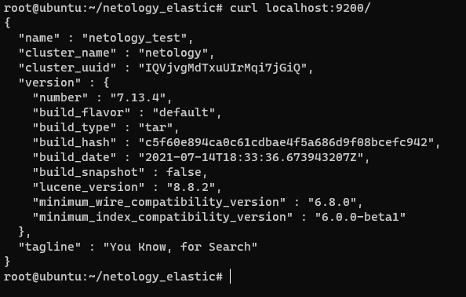
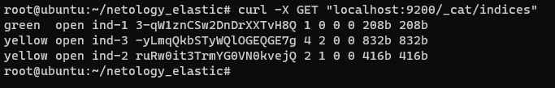
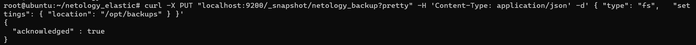
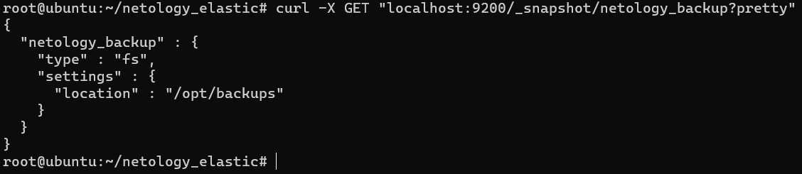
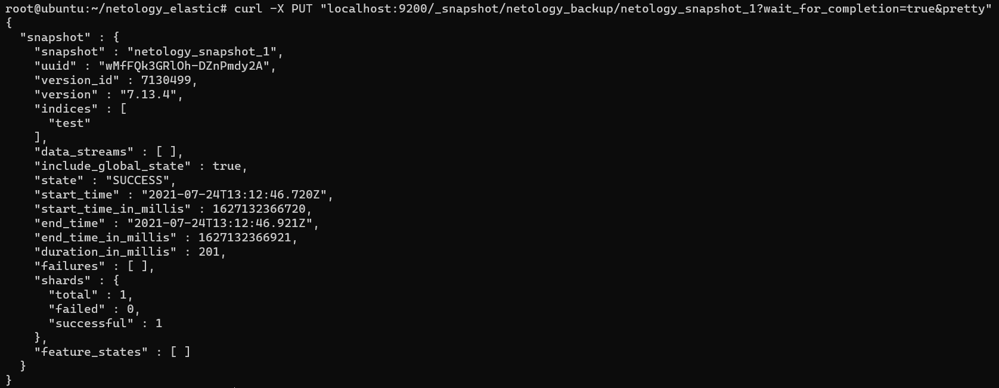
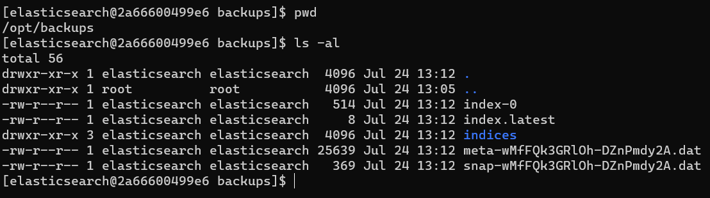
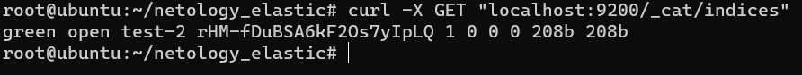
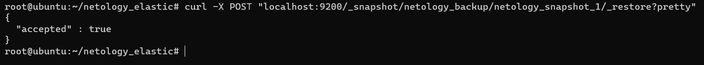
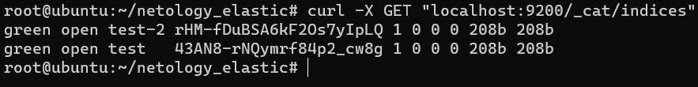

# Домашнее задание к занятию "6.5. Elasticsearch"

1.  [Elasticsearch 7.13.4](https://hub.docker.com/repository/docker/develtime/elasticsearch_netology)

    ```dockerfile
    FROM centos:7

    RUN yum install wget -y

    ENV ES_DISTRIB="/opt/elasticsearch"
    ENV ES_HOME="${ES_DISTRIB}/elasticsearch-7.13.4"
    ENV ES_DATA_DIR="/var/lib/elasticsearch"
    ENV ES_LOG_DIR="/var/log/elasticsearch"
    ENV ES_BACKUP_DIR="/opt/backups"
    ENV ES_JAVA_OPTS="-Xms512m -Xmx512m"

    WORKDIR "${ES_DISTRIB}"

    RUN wget --quiet https://artifacts.elastic.co/downloads/elasticsearch/elasticsearch-7.13.4-linux-x86_64.tar.gz && \
        wget --quiet https://artifacts.elastic.co/downloads/elasticsearch/elasticsearch-7.13.4-linux-x86_64.tar.gz.sha512 && \
        sha512sum --check --quiet elasticsearch-7.13.4-linux-x86_64.tar.gz.sha512 && \
        tar -xzf elasticsearch-7.13.4-linux-x86_64.tar.gz

    COPY elasticsearch.yml ${ES_HOME}/config

    ENV ES_USER="elasticsearch"

    RUN useradd ${ES_USER}

    RUN mkdir -p "${ES_DATA_DIR}" && \
        mkdir -p "${ES_LOG_DIR}" && \
        mkdir -p "${ES_BACKUP_DIR}" && \
        chown -R ${ES_USER}: "${ES_DISTRIB}" && \
        chown -R ${ES_USER}: "${ES_DATA_DIR}" && \
        chown -R ${ES_USER}: "${ES_LOG_DIR}" && \
        chown -R ${ES_USER}: "${ES_BACKUP_DIR}"

    USER ${ES_USER}

    WORKDIR "${ES_HOME}"

    EXPOSE 9200
    EXPOSE 9300

    ENTRYPOINT ["./bin/elasticsearch"]
    ```

    ```yaml
    ---
    discovery:
      type: single-node

    cluster:
      name: netology

    node:
      name: netology_test

    network:
      host: 0.0.0.0

    path:
      data: /var/lib/elasticsearch
      logs: /var/log/elasticsearch
      repo:
        - /opt/backups
    ```

    ```sh
    docker run --name elasticsearch_netology -d -p 9200:9200 -p 9300:9300 develtime/elasticsearch_netology:latest
    ```

    

2.  Индексы

    ```sh
    curl -X GET "localhost:9200/_cat/indices"
    ```

    

    Часть индексов находится в состоянии `yellow` потому что у нас неверно расчитано кол-во шардов и реплик, исходя из формул `index.number_of_shards = number_of_nodes * 3; index.number_of_replicas = number_of nodes - 1` можно понять, что для стабильной работы нам надо было выставлять `number_of_shards = 3` и `number_of_replicas = 0`, а в эти рамки вписывается только индекс `ind-1`

3.  Создание и восстановление бэкапов

    ```sh
    curl -X PUT "localhost:9200/_snapshot/netology_backup?pretty" -H 'Content-Type: application/json' -d' { "type": "fs",   "settings": { "location": "/opt/backups" } }'
    ```

    

    ```sh
    curl -X GET "localhost:9200/_snapshot/netology_backup?pretty"
    ```

    

    ```sh
    curl -X PUT "localhost:9200/test?pretty" -H 'Content-Type: application/json' -d'{ "settings": { "index": { "number_of_shards": 1, "number_of_replicas": 0 } } }'
    ```

    ```sh
    curl -X PUT "localhost:9200/_snapshot/netology_backup/netology_snapshot_1?wait_for_completion=true&pretty"
    ```

    

    

    ```sh
    curl -X DELETE "localhost:9200/test?pretty"
    ```

    ```sh
    curl -X PUT "localhost:9200/test-2?pretty" -H 'Content-Type: application/json' -d'{ "settings": { "index": { "number_of_shards": 1, "number_of_replicas": 0 } } }'
    ```

    ```sh
    curl -X GET "localhost:9200/_cat/indices"
    ```

    

    ```sh
    curl -X POST "localhost:9200/_snapshot/netology_backup/netology_snapshot_1/_restore?pretty"
    ```

    

    
