# Домашнее задание к занятию "3.5. Файловые системы"

###

2. Нет, не могут, это просто файлы ссылающиеся на один и тот же inode на файловой системе.

3. Создана VM с дополнительными дисками из конфигурационного файла Vagrantfile 
 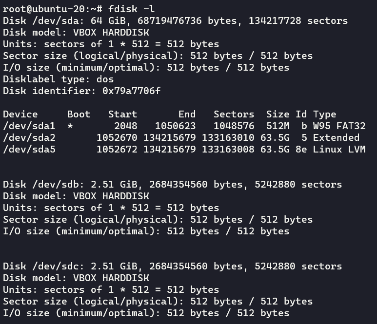

4. Разбиение диска 
 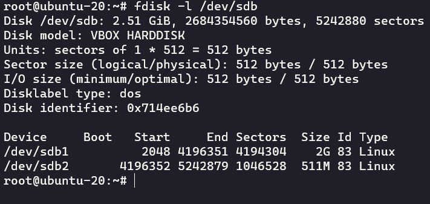

5. Перенос таблицы разделов
 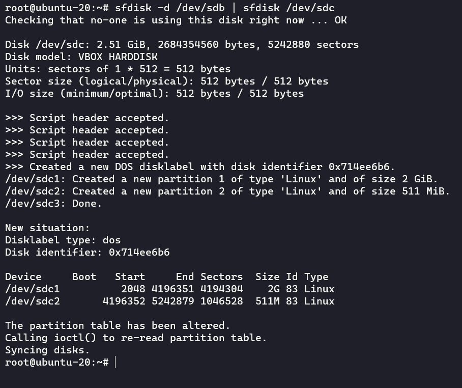
 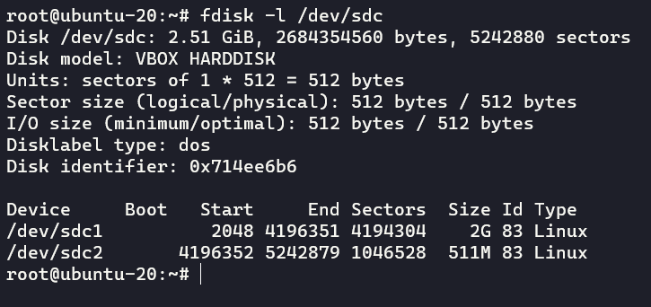

6. Сборка RAID1
7. Сборка RAID0 
 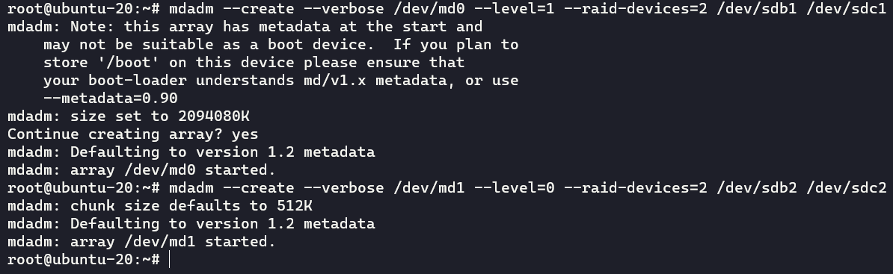
 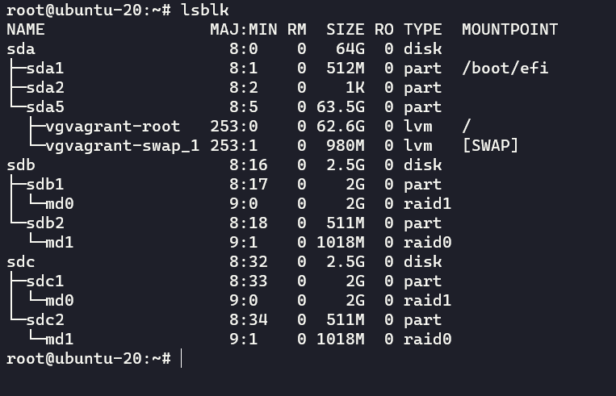

8. Создание Physical Volumes 
 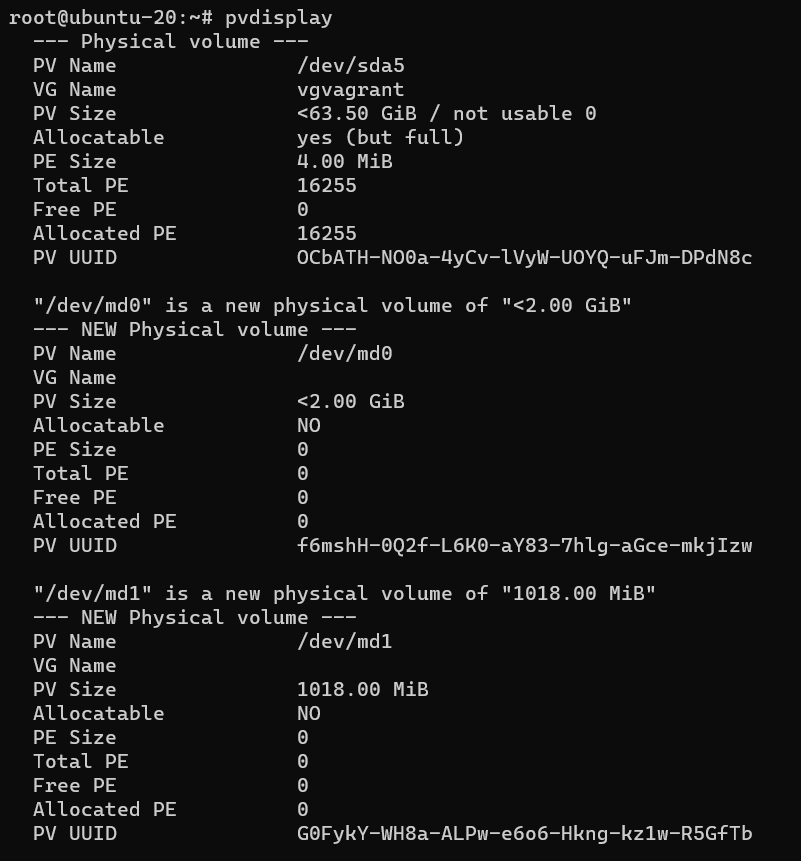

9. Создание Volume Groups 
 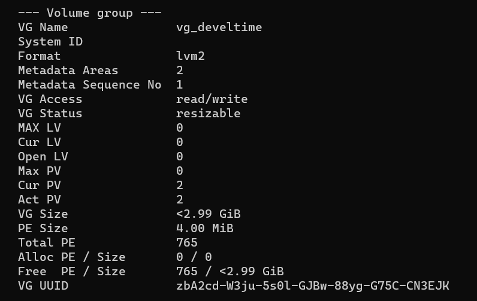

10. Создание Logical Volume размером 100 Мб 
 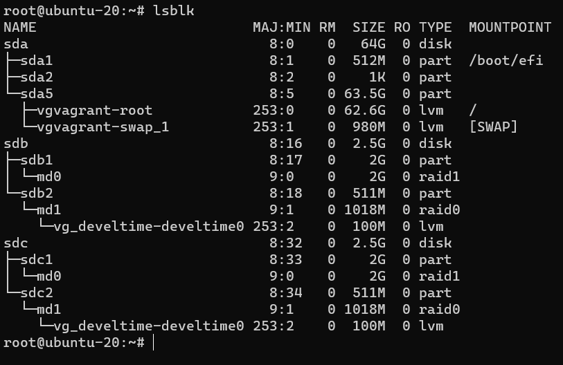

11. Создание файловой системы EXT4 
 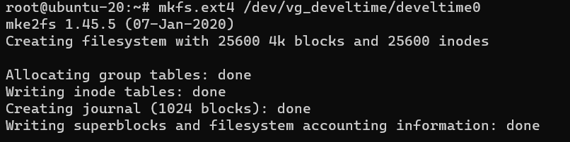

12. Монтирование раздела в директорию `mount /dev/vg_develtime/develtime0 /tmp/new`, либо при помощи редактирования `/etc/fstab`

13. Тестовый файл 
 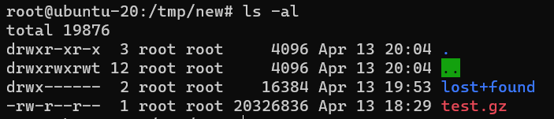

14. Вывод `lsblk` 
 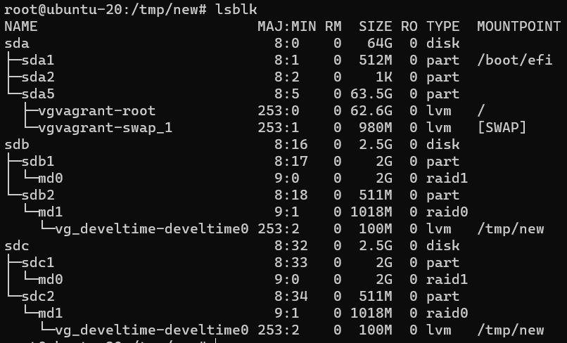

15. Целостность файла 
 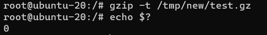

16. Перемещение содержимого PV с RAID0 на RAID1 
 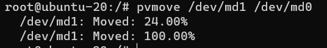
 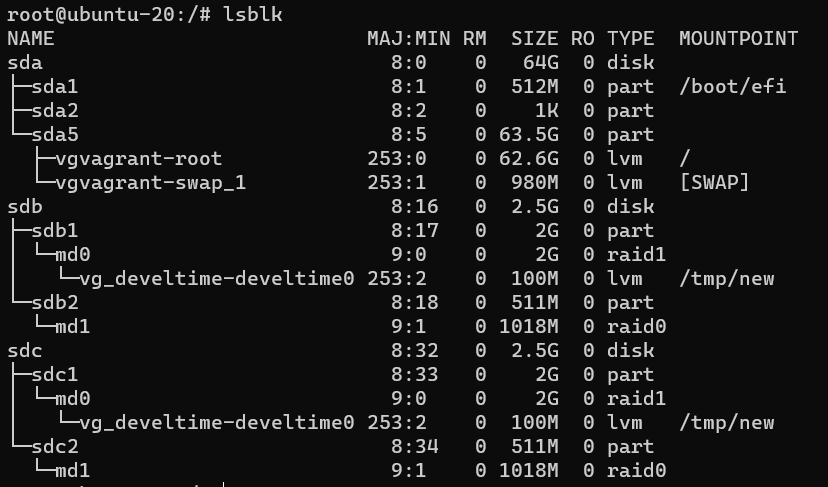

17. `mdadm --fail /dev/md0`

18. Вывод `dmesg` 
 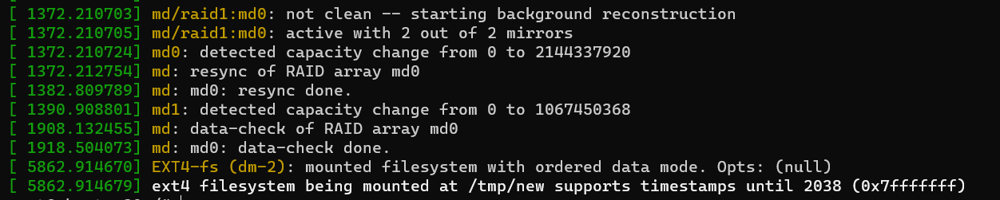

19. Целостность файла 
 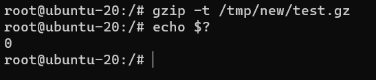
