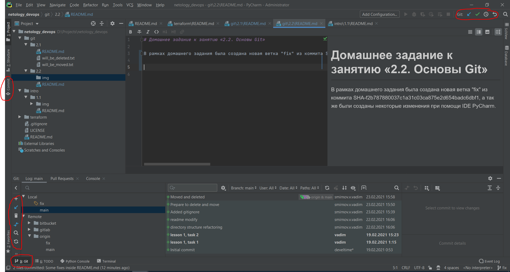

# Домашнее задание к занятию «2.2. Основы Git»

В рамках домашнего задания была создана новая ветка "fix" из коммита SHA-f2b787880037c1a31c03ca875e2d654badc6dbf1, а так же были созданы некоторые изменения при помощи IDE PyCharm.

