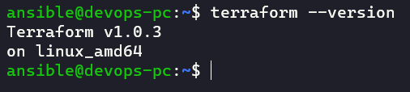
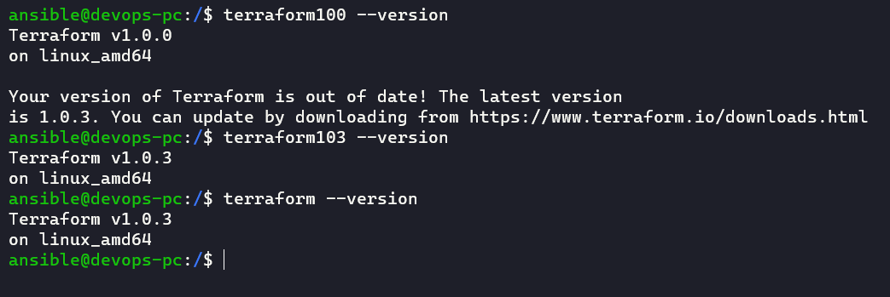

# Домашнее задание к занятию "7.1. Инфраструктура как код"

1. Выбор инструментов

   1. Ответы на поставленные вопросы

      1. Я бы использовал неизменяемую инфраструктуру на базе образов подготовленных через `Packer`
      2. Да, обязательно так как проект новый, точных требований нет и нам понадобится сервер для быстрого наращивания инфраструктуры при необходимости (в данном случае под центральным севером я понимаю AWS или VMWare VCenter)
      3. Если отвечать на вопрос со стороны что мы будем поднимать все сервисы в контейнерах в `Kubernetes`, то да, на всех серверах будут агенты и несколько мастер нод
      4. Я думаю, что в связи со всем вышеперечисленным, очевидным ответом будет, что да, будут использоваться средства для реализации подхода `IaC`

   2. Из уже используемых и знакомых в компании средств, использовались бы такие как `Terraform`, `Packer` для развертывания инфраструктуры, `Kubernetes`, `Docker` для развертывания приложения (всех его микросервисов, сторонних сервисов необходимых для функционирования приложения и возможно даже баз данных)

   3. Рассмотреть новые инструменты всегда интересно. Хоть их и не назвать новыми, но из тех что не перечисленны в задании, я бы рассмотрел такие как `Gitlab` и `Jenkins`

2. Установка терраформ

   

3. Поддержка легаси кода

   
