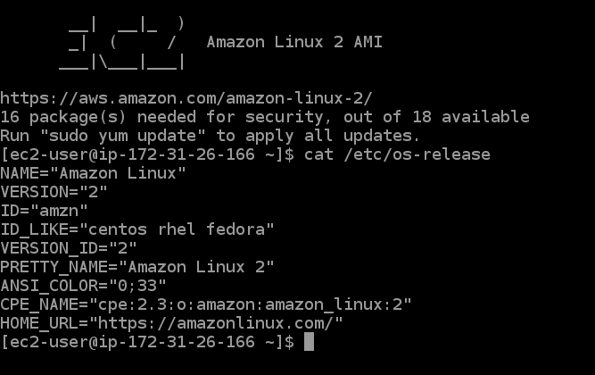
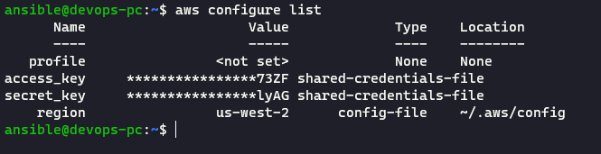

# Домашнее задание к занятию "7.2. Облачные провайдеры и синтаксис Терраформ."

1. Регистрация в aws и знакомство с основами

   

   

2. Создание ec2 через терраформ

   1. Packer
   2. [Terraform configuration](../../terraform)
