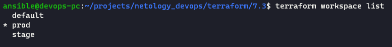

# Домашнее задание к занятию "7.3. Основы и принцип работы Терраформ"

## [Terraform configuration](../../terraform/7.3)

1. `terraform workspace list`

   

2. `terraform plan` - [plan.log](../../terraform/7.3/plan.log)