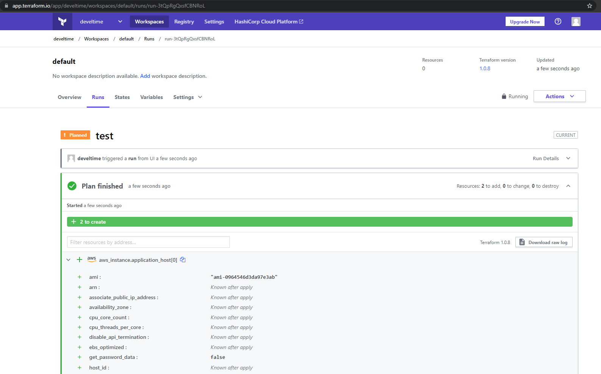

# Домашнее задание к занятию "7.4. Средства командной работы над инфраструктурой."

1. Terraform Cloud

    

2. Серверная конфигурация для `Atlantis`
   
   - [atlantis.yaml](https://github.com/develtime/terraform_test/blob/main/atlantis.yaml)
   - [server.yaml](https://github.com/develtime/terraform_test/blob/main/server.yaml)

3. Знакомство с каталогом модулей

    [Terraform configuration](../../terraform/7.4)