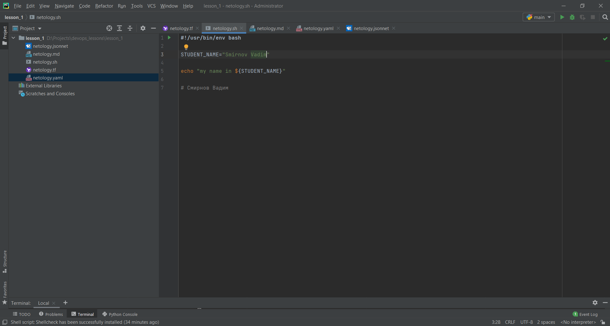

# Домашнее задание к занятию «1.1. Введение в DevOps»

## Задание №1 - Подготовка рабочей среды

- Jsonnet: 
- Markdown: 
- Bash: 
- Terraform: 
- Yaml: 

## Задание №2 - Описание жизненного цикла задачи (разработки нового функционала)

Я уже долгое время работаю в относительно небольшой IT компании занимающейся разработкой ПО программистом. В какой-то момент, по мере роста компании и объемов работ для нас остро встал вопрос CI/CD.

Процесс связанный с разработкой ПО я вижу следующим образом, так же основываясь на имеющемся опыте:

- Необходимо завести систему для контроля версий исходных кодов, ведения документации, а так же для постановки и контроля исполнения задач в компании у нас для этого используется Gitlab
- Необходимо обсудить со всеми участниками разработки ПО общую методологию рабочих процессов, таких как частота, длительность и время митингов, продолжительность спринтов, правильность постановки задач.

Сам жизненый цикл разработки я вижу примерно следующим образом:

- Обсуждение менеджера(ов) с программистами задач которые необходимо выполнить в данном спринте
- Постановка задач менеджером
- Выполнение задач (Разработка ПО)
- Тестирование ПО
- Закрытие спринта
- Пререлиз на тестовом стенде
- Проверка менеджером
- Показ продукта заказчику
- Релиз 

Свою роль как DevOps-инженера я вижу в необходимости убедиться, что все участники процесса разработки имеют доступ, 
знают и умеют пользоваться всеми необходимыми инструментами для процесса разработки ПО, а так же обеспечить своевременную публикацию ПО и автоматизацию всех связанных с этими задачами процессов.
Из личного опыта, в данный момент в нашей компании мы используем для этого Gitlab, Jenkins, Kubernetes, Docker (переходим на CRI-O), ansible.  