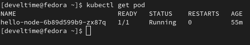

# Домашнее задание к занятию "12.1 Компоненты Kubernetes"

1. Minikube (Qemu-KVM: CentOS 8, IP: 192.168.122.10)
   
   

2. Minikube Dashboard & HelloWorld
   
   

   

3. Kuberctl (Localhost: Fedora 35, IP: 127.0.0.1)
   
   

   

   

   

