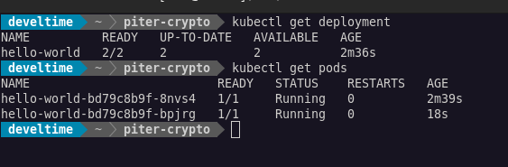
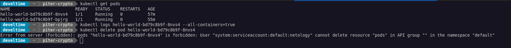
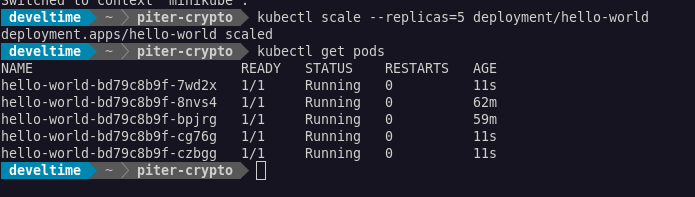

# Домашнее задание к занятию "12.2 Команды для работы с Kubernetes"

1. Запуск пода из образа в деплойменте
   
   

2. Просмотр логов для разработки
   
    ```yaml
    apiVersion: rbac.authorization.k8s.io/v1
    kind: ClusterRole
    metadata:
    creationTimestamp: "2022-02-24T18:35:41Z"
    name: netology
    resourceVersion: "8482"
    uid: 5c435bb8-9575-4baf-8f0e-f6e2826827a0
    rules:
    - apiGroups:
    - ""
    resources:
    - pods
    - pods/log
    verbs:
    - get
    - list
    - watch
    ```

    ```bash
    kubectl describe serviceaccount netology
    ```

    ```bash
    kubectl describe secrets netology-token-dzd88
    ```

    ```bash
    kubectl config set-credentials develtime --token=eyJhbGciOiJSUzI1NiIsImtpZCI6IjhBU3pqUGc1RkFTMUJiYjJtM3lTZ3JKbWNWTVp1SUZWSl94cjVUZ1RXYVUi...
    ```

    ```bash
    kubectl config set-context minikube-ro --cluster=minikube --user=develtime
    ```

    ```bash
    kubectl config use-context minikube-ro
    ```

    ```yaml
    users:
      - name: develtime
        user:
            token: eyJhbGciOiJSUzI1NiIsImtpZCI6IjhBU3pqUGc1RkFTMUJiYjJtM3lTZ3JKbWNWTVp1SUZWSl94cjVUZ1RXYVUi...
    ```

    ```yaml
    - context:
        cluster: minikube
        user: develtime
        name: minikube-ro
    ```


    

3. Изменение количества реплик

    