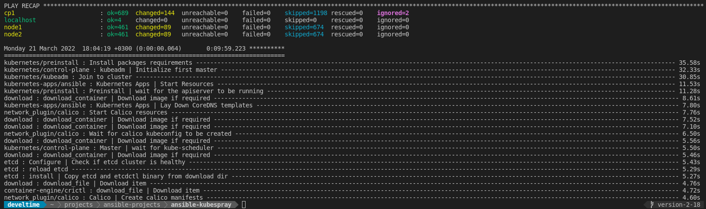
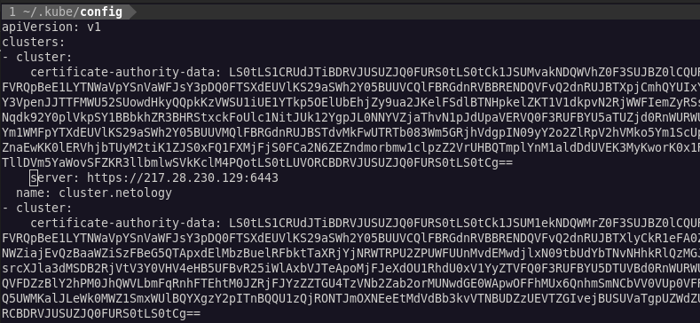
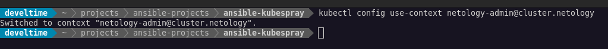
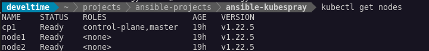
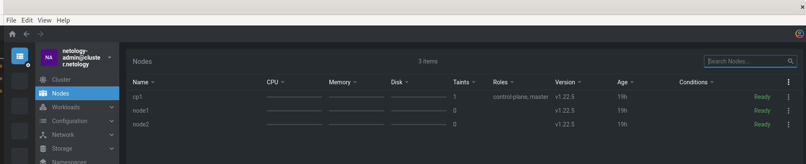

# Домашнее задание к занятию "12.4 Развертывание кластера на собственных серверах, лекция 2"

1. Подготовить инвентарь kubespray
   
   ```yaml
   all:
    hosts:
        cp1:
        ansible_host: 217.28.230.129
        ip: 10.0.0.10
        access_ip: 10.0.0.10
        node1:
        ansible_host: 51.250.5.140
        ip: 10.0.0.3
        access_ip: 10.0.0.3
        node2:
        ansible_host: 178.154.200.69
        ip: 10.0.0.14
        access_ip: 10.0.0.14
    vars:
        ansible_user: ansible
    children:
        kube_control_plane:
        hosts:
            cp1:
        kube_node:
        hosts:
            node2:
            node1:
        etcd:
        hosts:
            cp1:
        k8s_cluster:
        children:
            kube_control_plane:
            kube_node:
        calico_rr:
        hosts: {}
   ```

   ```yaml
   container_manager: containerd
   ```

   

   

   

   

   

   