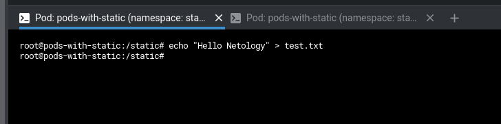
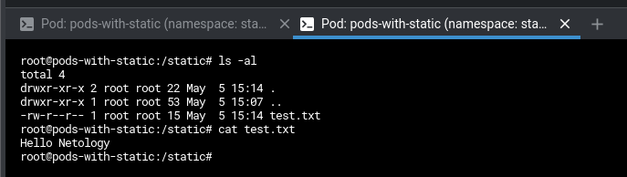
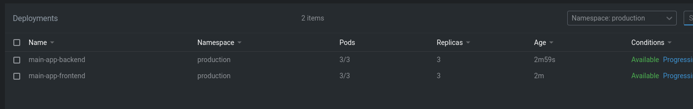
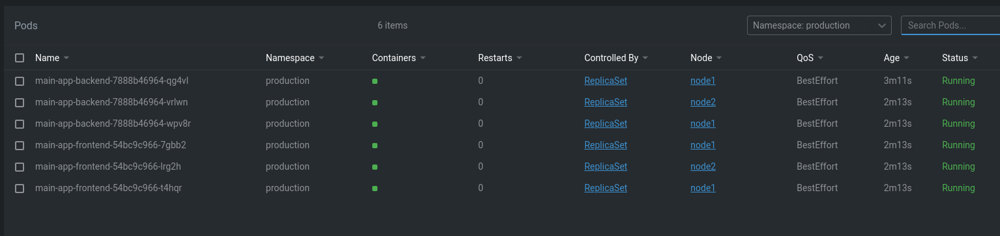
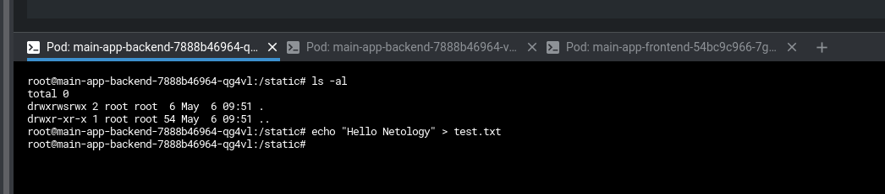
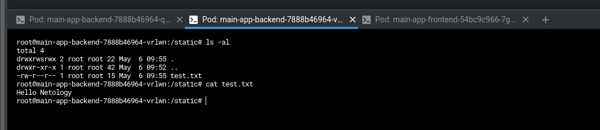
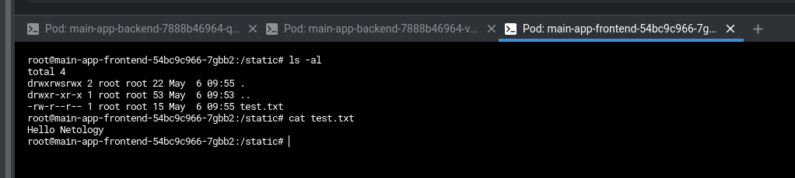

# Домашнее задание к занятию "13.2 разделы и монтирование"


1. Подключить для тестового конфига общую папку

    ```yaml
    ---
    apiVersion: v1
    kind: Namespace
    metadata:
      name: stage
    ---
    apiVersion: v1
    kind: Pod
    metadata:
      name: pods-with-static
      namespace: stage
    spec:
      restartPolicy: Never
      volumes:
      - name: static-vol
        hostPath:
          path: /netology/static-vol
      containers:
      - name: backend-pod
        image: develtime/example-backend:latest
        volumeMounts:
        - name: static-vol
          mountPath: /static
      - name: frontend-pod
        image: develtime/example-frontend:latest
        volumeMounts:
        - name: static-vol
          mountPath: /static
    ```

    

    


2. Подключить общую папку для прода

    Troubleshooting - на CentOS 7 столкнулся с необходимостью установки `sudo yum install nfs-utils cifs-utils -y`, возможно на других ОС проблема также присутствует

    ```yaml
    ---
    apiVersion: v1
    kind: Namespace
    metadata:
      name: production
    ---
    kind: PersistentVolumeClaim
    apiVersion: v1
    metadata:
      name: prod-nfs-volume-claim
      namespace: production
    spec:
      storageClassName: nfs
      accessModes:
        - ReadWriteMany
      resources:
        requests:
          storage: 100Mi
    ---
    apiVersion: apps/v1
    kind: Deployment
    metadata:
      labels:
        app: main-app-backend
      name: main-app-backend
      namespace: production
    spec:
      replicas: 3
      selector:
        matchLabels:
          app: main-app-backend
      template:
        metadata:
          labels:
            app: main-app-backend
          namespace: production
        spec:
          containers:
            - image: develtime/example-backend:latest
              imagePullPolicy: IfNotPresent
              name: prod-backend
              volumeMounts:
              - name: backend-persistent-storage
                mountPath: /static
          volumes:
          - name: backend-persistent-storage
            persistentVolumeClaim:
              claimName: prod-nfs-volume-claim
          restartPolicy: Always
    ---
    apiVersion: apps/v1
    kind: Deployment
    metadata:
      labels:
        app: main-app-frontend
      name: main-app-frontend
      namespace: production
    spec:
      replicas: 3
      selector:
        matchLabels:
          app: main-app-frontend
      template:
        metadata:
          labels:
            app: main-app-frontend
          namespace: production
        spec:
          containers:
            - image: develtime/example-frontend:latest
              imagePullPolicy: IfNotPresent
              name: prod-frontend
              volumeMounts:
              - name: frontend-persistent-storage
                mountPath: /static
          volumes:
          - name: frontend-persistent-storage
            persistentVolumeClaim:
              claimName: prod-nfs-volume-claim
          restartPolicy: Always
    ```

    

    

    

    

    