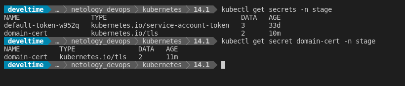
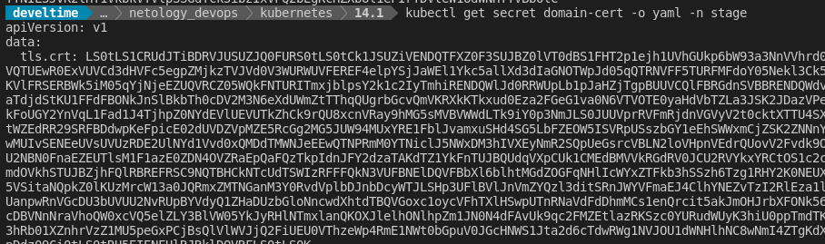
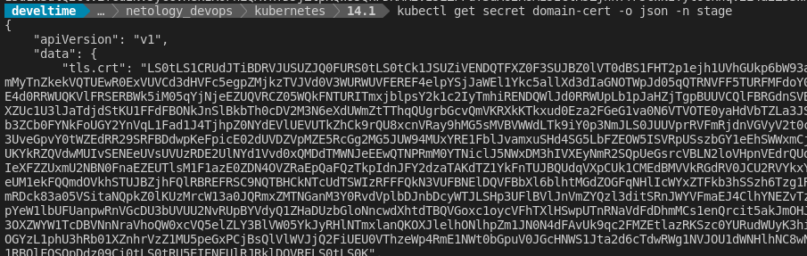
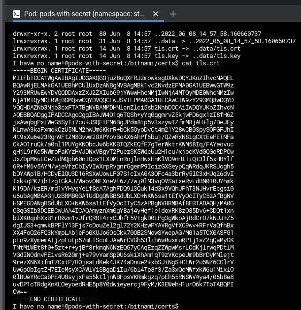
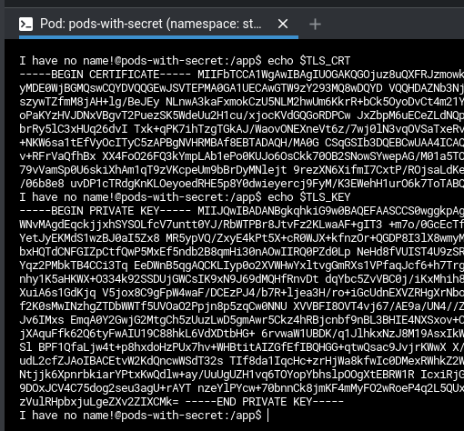

# Домашнее задание к занятию "14.1 Создание и использование секретов"

1. Работа с секретами
   
   

   

   

   [domain-certs.yaml](files/domain-certs.yml)

2. Работа с секретами в подах
   
   [Манифест](files/pod-with-secret.yml)

   

   

