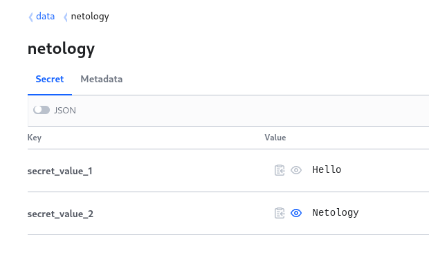
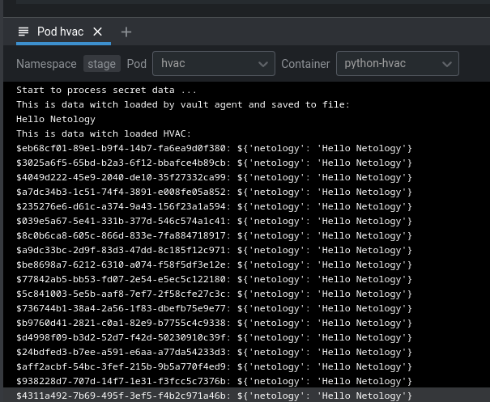

# Домашнее задание к занятию "14.2 Синхронизация секретов с внешними сервисами. Vault"

Я немного объеденил задание 1 и задание 2(*) в одно. Я создал легкий [докер образ](docker/Dockerfile) с `python` и модулем `hvac` что бы не тянуть тяжелый контейнер с Fedora. Создал 2 манифеста: 1 - [простой манифест](manifests/01-vault.yml) который поднимает pod с vault и сервисом к нему, 2 - [манифес](manifests/02-hvac.yml) который основан на моем докер образе и vault запущенном в режиме агента как `initContainer`. Таким образом это является демонстрацией как и получения секретов средствами Vault API, так и получения секретов через Vault Agent когда приложение ничего не знает об источнике секретов.

