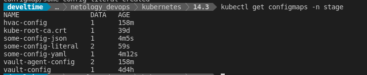
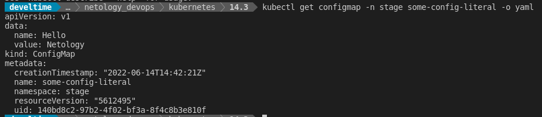
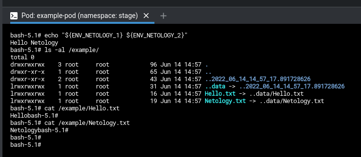

# Домашнее задание к занятию "14.3 Карты конфигураций"

1. Работа с картами конфигураций через утилиту kubectl

 - `kubectl create configmap some-config-yaml -n stage --from-file=files/some_config.yml`
 - `kubectl create configmap some-config-json -n stage --from-file=files/some_config.json`
 - `kubectl create configmap some-config-literal -n stage --from-literal=name=Hello --from-literal=value=Netology`

    

    

     [ConfigMap from manifest](manifests/01-cm.yml)

2. Работа с картами конфигураций внутри модуля
   
   [Манифест](manifests/02-pod.yml)

   