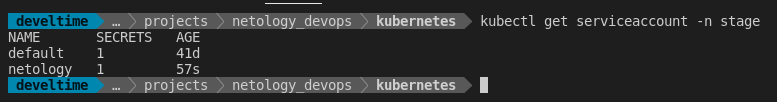
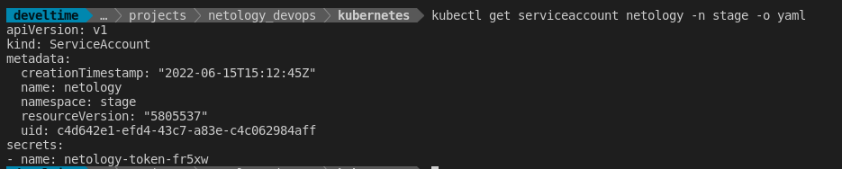
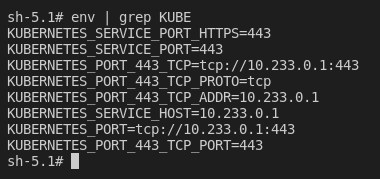
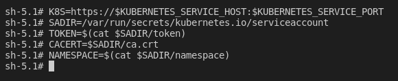
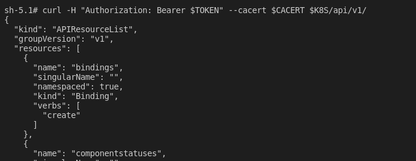

# Домашнее задание к занятию "14.4 Сервис-аккаунты"

1. Работа с сервис-аккаунтами через утилиту kubectl

    - `kubectl create serviceaccount netology -n stage`
    - `kubectl get serviceaccount -n stage`
  
    

    

    [Service account manifest](manifests/01-svc-netology.yml)

2. Работа с сервис-акаунтами внутри пода
   
   - `kubectl run -n stage -i --tty fedora --image=fedora --restart=Never -- sh`
  
    

    

    