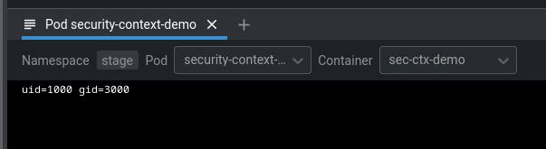
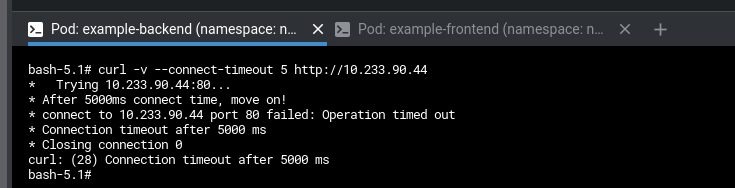
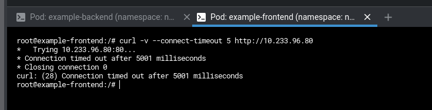
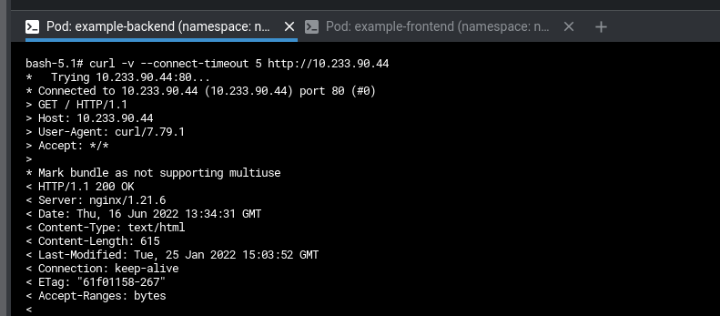
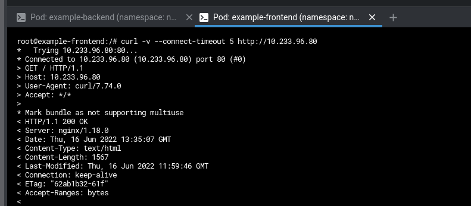
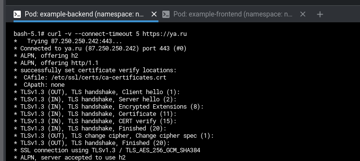
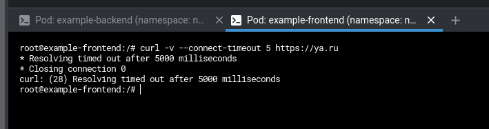

# Домашнее задание к занятию "14.5 SecurityContext, NetworkPolicies"

1. Security context

    - [Manifest](manifests/01-security-context.yml)

    

2. Пример с Network policy

    - [Namespace](manifests/00-namespace.yml)
    - [Pods](manifests/02-pods.yml)
    - [Default policy](manifests/03-default-policy.yml)

    

    

    - [Frontend policy](manifests/04-frontend-policy.yml)
    - [Backend policy](manifests/05-backend-policy.yml)

    

    

    

    

    
