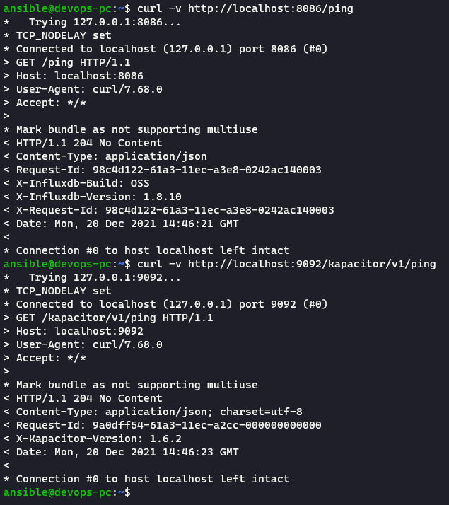
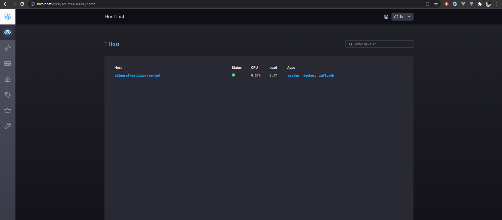
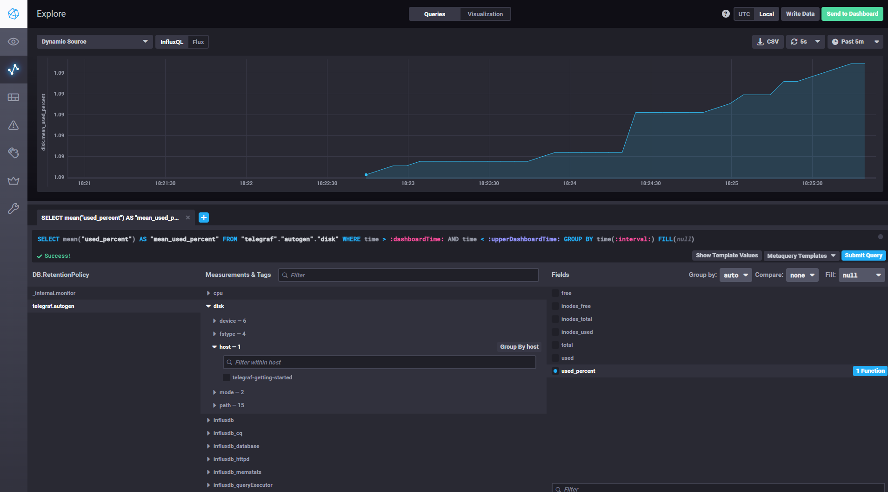
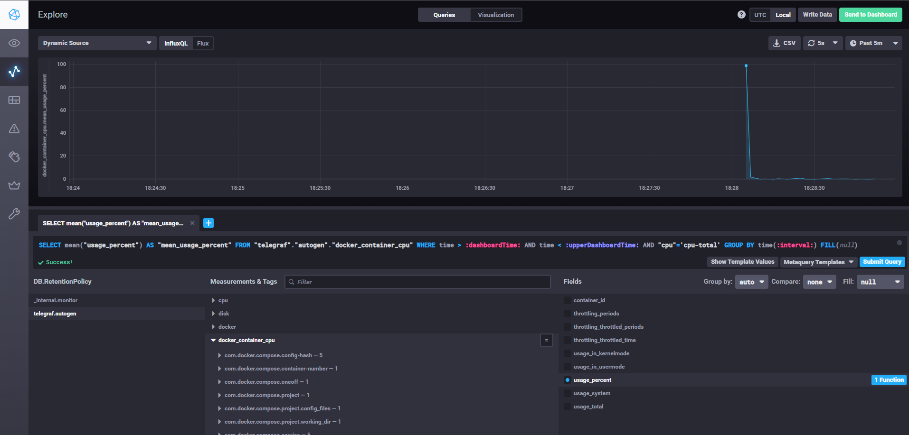

# Домашнее задание к занятию "10.2. Системы мониторинга"

1. Если коротко то плюсы PUSH модели в скорости передачи метрик, можем настроить агент на отправку сразу в N серверов сбора метрик, так же эта модель хорошо подходит в ситуации когда все ваши агенты находятся в закрытой сети куда нет доступа у сервера мониторинга, минусы в отсутствии гарантии передачи, необходимо более тонко настраивать агентов, что бы они не заспамили сеть метриками, PULL модель хороша тем что нам удобно настраивать из одной точки то что и как часто мы собраемся опрашивать, так как сервер сам опрашивает метрики, есть гарантия получения метрик так как обмен осуществляется по HTTP, из минусов, мы теряем в скорости получения метрик, они более тяжелые, для получения метрик из закрытого контура придется плясать с прокси, такими как Pushgateway или Zabbix-Poxy.
2. Системы мониторинга:
   - Prometheus - PULL модель (Exporter собирает и хранит метрики до тех пор пока сервер не соберет их), в целом с помощью Pushgateway можно реализовать и PUSH модель
   - TICK - PUSH модель (Telegraf собирает метрики и отправляет их в TSDB)
   - Zabbix - PUSH и PULL модель (Zabbix agent имеет активные и пассивные шаблоны сбора метрик)
   - VictoriaMetrics - Наверное больше подходит под термин гибридной модели, так как получает данные по Prometeus remote write API, от N серверов Prometeus и с нее можно забрать данные через PromQL, используется когда есть необходимость горизонтально размаштабировать Prometeus или для геораспределенных систем мониторинга
   - Nagios - никогда не использовад Nagios, надеюсь и не буду, на сколько я знаю это как и Zabbix гибридная модель
3. TICK
   
   
   

4. Disk usage
   
   

5. Docker
   
   