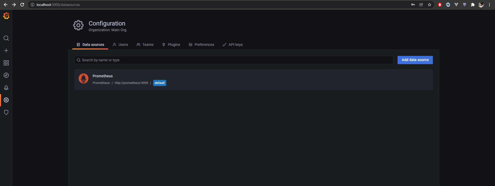
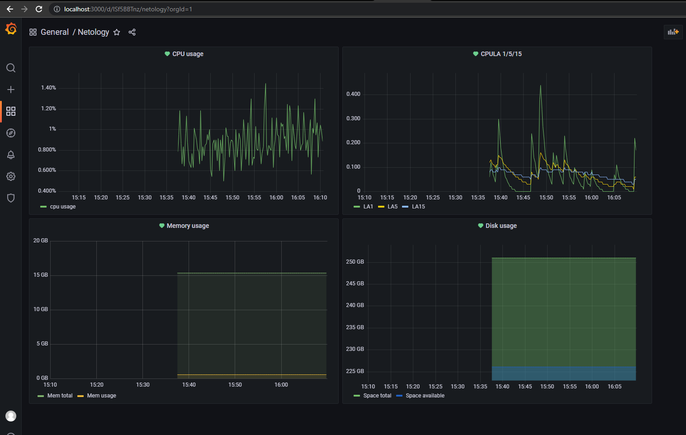
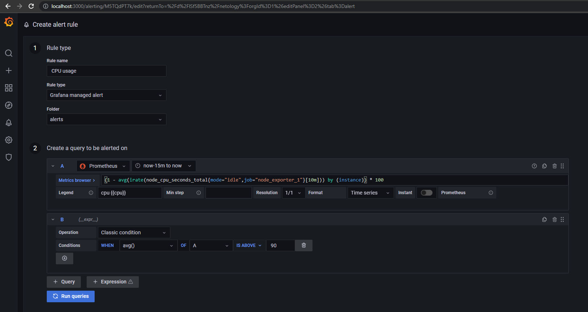

# Домашнее задание к занятию "10.3. Grafana"

1. [Grafana - Prometheus - Node_exporter](files)
   
   

2. [Dashboards](files/netology_dashboard.json)
   
   - `(1 - avg(irate(node_cpu_seconds_total{mode="idle",job="node_exporter_1"}[5m])) by (instance)) * 100`
   - 3 запроса на одном графике `node_load1{job="node_exporter_1"}`, `node_load5{job="node_exporter_1"}`, `node_load15{job="node_exporter_1"}`
   - 2 запроса на одном графике `(node_memory_MemTotal_bytes{job="node_exporter_1"}) / 1073741824`, `(node_memory_Active_bytes{job="node_exporter_1"}) / 1073741824`
   - 2 запроса на одном графике `(avg by(instance)(node_filesystem_size_bytes{job="node_exporter_1"})) / 1073741824`, `(avg by(instance)(node_filesystem_avail_bytes{job="node_exporter_1"})) / 1073741824` (в моем примере я использовал среднее значение т.к. как у меня 3 точки монтирования на один диск, в других случаях можно было бы сгруппировать график про `device` или `moutpoint`)

    

3. Пример правила алертинга
   
   

4. [JSON model](files/netology_dashboard.json)