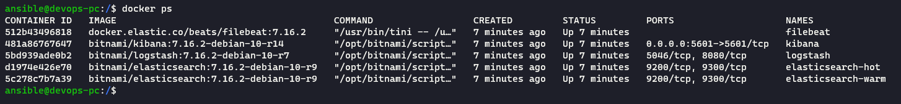
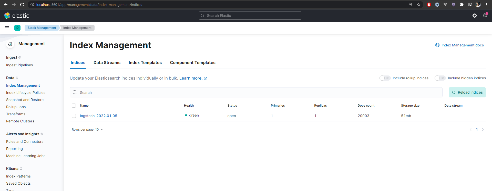
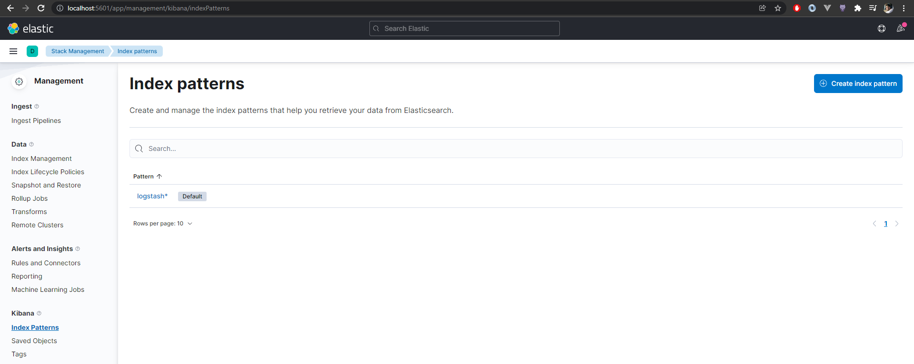

# Домашнее задание к занятию "10.4. ELK"

1. [ELK Стэк](elk)
   
   

   

2. Index pattern
   
   

p.s. Я использую Windows 11 с WSL2 и из-за особенностей работы `Docker` нет возможности подцепить докер логи, они в моем случае просто не маунтятся в виртуальную машину (директория `/var/lib/docker` всегда пуста), так что пришлось придумывать воркэраунд для выполнения домашнего задания с фейковыми логами, которые я просто пробросил из вирутальной машины в контейнер с `filebeat`