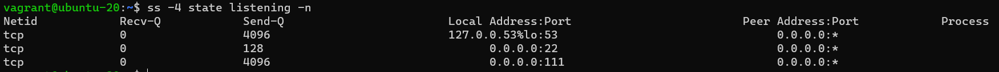

# Домашнее задание по лекции "3.6. Компьютерные сети (лекция 1)"

1. К сожалению, как мною было прочитано в нескольких постах на форумах, сервис `telnet towel.blinkenlights.nl` более недоступен, посмотрел вэб версию
2. В разделяемой среде WiFi при работе на 2.4 ГГц действительно независимых каналов 3 (1, 6, 11) - это связанно с шириной канала в 20 МГц (в некоторых случаях частота может быть больше) и интервалами 5 МГц между каналами (каналов на WiFi 2.4 ГГц 13, в некоторых странах 11) из чего видно, что соседние каналы оказывают значительное влияние друг на друга и только каналы 1,6 и 11 имеют достаточный интервал для того что бы не оказывать влияние друг на друга. При работе в сети 5 ГГц с шириной канала в 40 МГц этими каналами являются 3 и 11.
3. OUI `38:f9:d3` MAC адреса `38:f9:d3:55:55:79` принадлежит `Apple, Inc.`
4. MSS (payload) можно высчитать по формуле `MTU - TCP header - IP header`, таким образом `9001 - 20 - 32 = 8949`
5. На сколько я понял из лекции и прочитанных материалов по флагам TCP, флаги `SYN` и `FIN` не могут быть установленны одновременно, это нарушает правила TCP, по сути, один флаг запрашивает установления соединения, а 2й его прекращения, скорее всего подобные TCP сегменты будут заблокированы ОС.
6. В данном примере мы запрашиваем список всех прослушиваемых UDP соединений отфильтрованных по порту 53 (DNS) и так как UDP это протокол не требующий предварительного сообщения для установки соединения, то статус может быть или `UNCONN`, или `ESTAB`
7. Состояния TCP соедиения на клиенте и сервере в момент завершения

    | Клиент | Флаг | Сервер |
    | ------ | ------ | ------ |
    | `ESTABLISHED` | FIN/ACK -> | `ESTABLISHED` |
    |     `FIN-WAIT-1`  |   <- ACK  | `CLOSE-WAIT`  |
    |     `FIN-WAIT-2`  |  <- FIN  | `LAST-ACK`  |
    |     `TIME-WAIT`  |  ACK ->  | `CLOSED`  |
    |     `CLOSED`  |   |   |

8. Теоритически, максимальное кол-во TCP соедений `65535`. На уровне TCP `server port, server ip, client port, client ip` должен быть уникальным для каждого одновременного соединения, тем самым я понимаю это как то, что один клиент не может открыть более `65535` одновременных подключений к серверу, но при этом сервер, теоритически, способен обслуживать `65535` одновременных подключений на клиента (под клиентом я понимаю отдельно взятый IP адрес, а не службу запущенную на одном IP адресе создающую несколько соединений с одним и тем же сервером). Если же рассматривать клиента как службу запущенную на одном IP адресе, но открывающую множество соединений с одним сервером, то такой клиент столкнется с ограничением по кол-ву открытых одновременно портов.
9. На сколько я могу судить, то ситуация при которой "условно" большое кол-во соединений находится в состоянии `TIME-WAIT` встречается достаточно часто. Как это видится мне, то она точно не является хорошей, так как при высокой нагрузке сети в какой-то момент может возникнуть ситуация при которой будет не возможно создать соединение, по причине того что утилизация соединений происходит медленнее чем спрос на открытие новых.
10. Фрагментация UDP плоха по сравнению с фрагментацией TCP тем, что нет гарантии доставки или гарантии доставки в правильном порядке, что неминуемо ведет к потере данных.
11. Прочитав про протокол `syslog`, я не совсем понял, что имелось ввиду: "Какой-бы протокол транспорного уровня я бы выбрал?", тогда как `syslog` это стандарт описанный в `RFC 3164` и может работать как на `TCP` так и на `UDP`, но если говорить абстрагированно от этого, я бы наверно выбрал бы протокол `UDP` передавая по нему короткие сообщения.
12. DNS, SSH, RPC
    
13. Для вывода содержимого фреймов в текстовом виде `-v`, шестнадцатиричном `-x`, в текстовом и шестнадцатиричном `-vx`
14. IP флаги
    
    Флаги `IP` - это 3 бита отвечающие, как видно из скриншота, за `Зарезервирован/Не фрагментировать/У пакета ещё есть фрагменты`. Ethernet - это LAN (Local Area Network).
    OUI `F8:0D:AC HP Inc.`
    