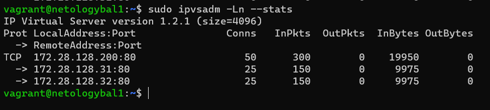
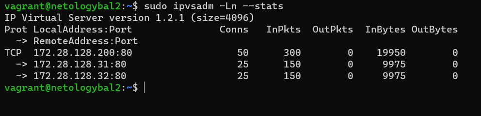

# Домашнее задание к занятию "3.8. Компьютерные сети, лекция 3"

1. Это связанно с особенностью режима `DR`, если `real` сервер инициировал завершение соединения `FIN`, то директор сможет узнать об этом только по `FIN-ACK` от клиента, так как при режиме `DR` пакеты от `real` сервера на клиент летят минуя директора. Директор же должен в любом случае сделать вывод о том, что соединение закрыто из частичной информации и использует свою собственную таблицу тайм-аутов.
2. Мною было развернуто 5 серверов:
   - Клиент `netologyclient`
   - Балансировщик 1 `netologybal1`
   - Балансировщик 2 `netologybal2`
   - Реал 1 `netologyapp1`
   - Реал 1 `netologyapp2`

    <br/>

    ```ruby
    boxes = {
        "netologyclient" => "10",
        "netologybal1" => "21",
        "netologybal2" => "22",
        "netologyapp1" => "31",
        "netologyapp2" => "32",
    }

    Vagrant.configure("2") do |config|
        config.vm.network "private_network", virtualbox__intnet: true, auto_config: false
        config.vm.box = "bento/ubuntu-20.04"

        boxes.each do |hostname, addr|
            config.vm.define hostname do |node|
                node.vm.hostname = hostname

                node.vm.provider "virtualbox" do |v|
                    v.name = hostname + "(Vagrant)"
                end

                node.vm.provision "shell" do |s|
                    s.inline = "hostname $1;" \
                    "ip addr add $2 dev eth1;" \
                    "ip link set dev eth1 up;" \
                    "if [[ $1 == *\"client\"* ]]; then apt -y install arping; fi;" \
                    "if [[ $1 == *\"bal\"* ]]; then apt -y install keepalived ipvsadm; fi;" \
                    "if [[ $1 == *\"app\"* ]]; then apt -y install nginx; fi;"
                    s.args = [hostname, "172.28.128.#{addr}/24"]
                end
            end
        end
    end
    ```
    Конфигурационный файл `/etc/keepalived/keepalived.conf` хоста `netologybal1`:

    ```conf
    vrrp_instance vrrp_1 {
        state MASTER
        interface eth1
        virtual_router_id 200
        priority 100
        advert_int 1

        authentication {
            auth_type PASS
            auth_pass 12345
        }

        virtual_ipaddress {
            172.28.128.200/24 dev eth1 label eth1:200
        }
    }

    virtual_server 172.28.128.200 80 {
        delay_loop 10
        lb_algo rr
        lb_kind DR
        protocol TCP

        real_server 172.28.128.31 80 {
            weight 1
            TCP_CHECK {
                connect_timeout 10
                connect_port    80
            }
        }

        real_server 172.28.128.32 80 {
            weight 1
            TCP_CHECK {
                connect_timeout 10
                connect_port    80
            }
        }
    }
    ```
    <br/>

    Конфигурационный файл хоста `netologybal2` отличается настройками `state BACKUP` и `priority 50`.<br/>

    Настройки на реалах для работы `DR`:<br/>

    ```sh
    sudo iptables -t nat -A PREROUTING -p TCP -d 172.28.128.0/24 --dport 80 -j REDIRECT
    ```

    и<br/>

    ```sh
    sudo sysctl -w net.ipv4.ip_forward=1
    ```
    Проверка:<br/>
    
    
    
    
    

3. На сколько я понял вопрос, то у нас 3 активных балансировщика, которые все `MASTER` и одновременно `BACKUP` друг другу, у них на интерфейсах пропускная способность по 1Гбит/сек, а к нам летит траффик в 1.5Гбит/сек, таким образом как я это понял нам нужно 3 IP адреса, при вылете 1го балансировщика, его IP на себя заберет соседний и 2 балансровщика с пропускной способностью в 1Гбит/сек все еще смогут без деградации обрабатывать 1.5Гбит/сек траффика.