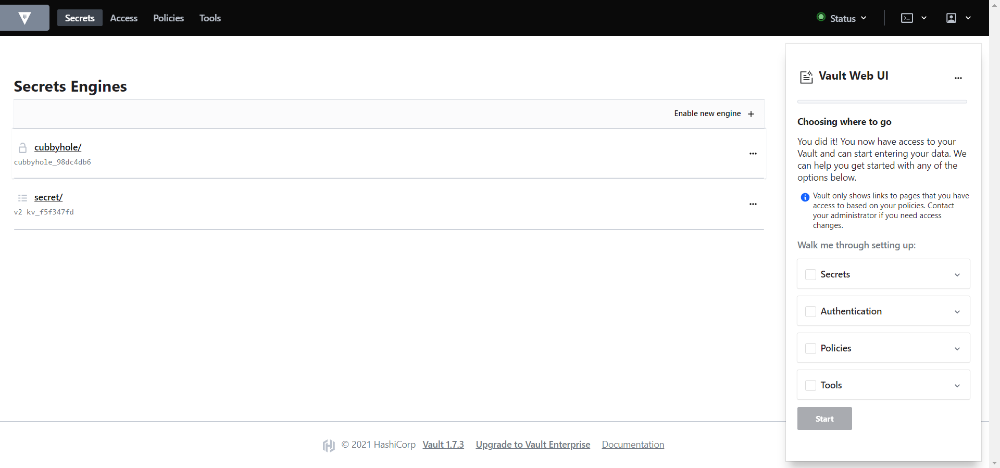
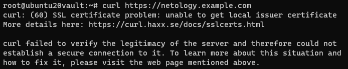
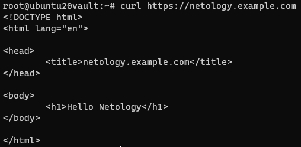
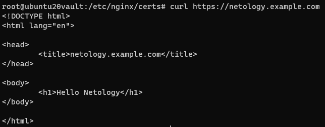

# Домашнее задание к занятию "3.9. Элементы безопасности информационных систем"

1.  Установка `Hashicorp Vault`

    ```ruby
    Vagrant.configure("2") do |config|
        config.vm.box = "bento/ubuntu-20.04"

        config.vm.hostname = "ubuntu20vault"

        config.vm.provider "virtualbox" do |v|
            v.name = "Ubuntu-20.04-Vault(Vagrant)"
            v.memory = 2048
            v.cpus = 2
        end

        config.vm.network "forwarded_port", guest: 8200, host: 8200
        config.vm.network "forwarded_port", guest: 80, host: 80
        config.vm.network "forwarded_port", guest: 443, host: 443

        config.vm.provision "shell", path: "install_vault.sh"
    end
    ```

    install_vault.sh

    ```sh
    curl -fsSL https://apt.releases.hashicorp.com/gpg | sudo apt-key add -

    sudo apt-add-repository "deb [arch=amd64] https://apt.releases.hashicorp.com $(lsb_release -cs) main"

    sudo apt-get update && sudo apt-get install vault
    ```

2.  Запуск `Hashicorp Vault`

    ```sh
    vault server -dev -dev-listen-address="0.0.0.0:8200"
    ```

    <br/>

    

    <br/>

3.  Создание `Root CA` и `Intermediate CA`

    ```sh
    export VAULT_ADDR='http://127.0.0.1:8200'
    ```

    **Root CA**

    Активируем секреты по пути `pki`

    ```sh
    vault secrets enable -path=pki pki
    ```

    Устанавливаем `ttl`

    ```sh
    vault secrets tune -max-lease-ttl=8760h pki
    ```

    Генерируем рутовый сертификат и сохраняем его в файл `ca_example_cert.crt`

    ```sh
    vault write pki/root/generate/internal common_name="example.com" ttl=8760h
    ```

    Прописываем `CA` и `CRL` пути для нашего центра сертификации

    ```sh
    vault write pki/config/urls issuing_certificates="$VAULT_ADDR/v1/pki/ca" crl_distribution_points="$VAULT_ADDR/v1/pki/crl"
    ```

    **Intermediate CA**

    Активируем секреты по пути `pki_int`

    ```sh
    vault secrets enable -path=pki_int pki
    ```

    Устанавливаем `ttl`

    ```sh
    vault secrets tune -max-lease-ttl=8760h pki_int
    ```

    Генерируем `csr` и сохраняем его в файл `pki_int.csr`

    ```sh
    vault write pki_int/intermediate/generate/internal common_name="example.com Intermediate Authority" ttl=8760h
    ```

    Отправляем полученный `csr` запрос на подпись в корневой центр сертификации и сохраняем полученный промежуточный сертификат в файл `intermediate_cert.pem`

    ```sh
    vault write pki/root/sign-intermediate csr=@pki_int.csr format=pem_bundle ttl=8760h
    ```

    Импортируем полученный сертификат в `Vault` в `pki_int`

    ```sh
    vault write pki_int/intermediate/set-signed certificate=@intermediate_cert.pem
    ```

    Прописываем `CA` и `CRL` пути для промежуточного центра сертификации

    ```sh
    vault write pki_int/config/urls issuing_certificates="$VAULT_ADDR/v1/pki_int/ca" crl_distribution_points="$VAULT_ADDR/v1/pki_int/crl"
    ```

4.  Создаем роль для `example.com` и запрашиваем сертификат для `netology`

    ```sh
    vault write pki_int/roles/example-dot-com allowed_domains="example.com" allow_subdomains=true max_ttl="8760h"
    ```

    ```sh
    vault write pki_int/issue/example-dot-com common_name="netology.example.com" ttl="72h"
    ```

5.  Поднят `nginx` и добавлен сгенерированный сертификат
    <br/>
    

6.  Сертификат `ca_example_cert.crt` копируем в `/usr/share/ca-certificates` и добавляем в конфиг `/etc/ca-certificates.conf`
    <br/>
    Вызываем

    ```sh
    update-ca-certificates
    ```

    <br/>

    

7.  Ознакомился с протоколом `ACME` и сервисом `Letsencrypt`, но к сожалению в настоящее время у меня нет домена во владении на котором я бы мог проверить его работу в живую.

8.  Скачиваем и распаковываем архив с `consul-template`, далее настраиваем `pki-demo.hcl`

    ```conf
       vault {
          address = "http://127.0.0.1:8200"
          token = "s.QfJLhOBY7GiOFTLF6FrSsmtx"
          renew_token = true

          retry {
             enabled = true
             attempts = 5
             backoff = "250ms"
          }
       }

       template {
          source      = "/etc/consul-template.d/netology-cert.tpl"
          destination = "/etc/nginx/certs/netology_cert.crt"
          perms       = "0600"
          command     = "systemctl reload nginx"
       }

       template {
          source      = "/etc/consul-template.d/netology-key.tpl"
          destination = "/etc/nginx/certs/netology_key.pem"
          perms       = "0600"
          command     = "systemctl reload nginx"
       }
    ```

    Создаем 2 шаблона для сертификата и приватного ключа

    ```jinja
    {{- /* netology-cert.tpl */ -}}
    {{ with secret "pki_int/issue/example-dot-com" "common_name=netology.example.com"     "ttl=2m" }}
    {{ .Data.certificate }}
    {{ .Data.issuing_ca }}{{ end }}
    ```

    ```jinja
    {{- /* netology-key.tpl */ -}}
    {{ with secret "pki_int/issue/example-dot-com" "common_name=netology.example.com" "ttl=2m"}}
    {{ .Data.private_key }}{{ end }}
    ```

    Настраиваем демона

    ```ini
    [Unit]
    Description=consul-template
    Requires=network-online.target
    After=network-online.target

    [Service]
    EnvironmentFile=-/etc/sysconfig/consul-template
    Restart=on-failure
    ExecStart=/usr/local/bin/consul-template $OPTIONS -config='/etc/consul-template.d/pki-demo.hcl'
    KillSignal=SIGINT

    [Install]
    WantedBy=multi-user.target
    ```

    ```sh
    systemctl daemon-reload
    systemctl enable consul-template.service
    systemctl start consul-template.service
    ```

    Меняем пути до сертификатов в `nginx`

    ```conf
    server {

       listen 443 ssl;

       server_name netology.example.com;

       root /var/www/netology/;

       ssl_certificate  /etc/nginx/certs/netology_cert.crt;
       ssl_certificate_key  /etc/nginx/certs/netology_key.pem;

       location / {
          autoindex on;
          try_files $uri /index.html;
       }

    }
    ```

    ```sh
    systemctl reload nginx
    ```

    Проверка

    <br/>

    
