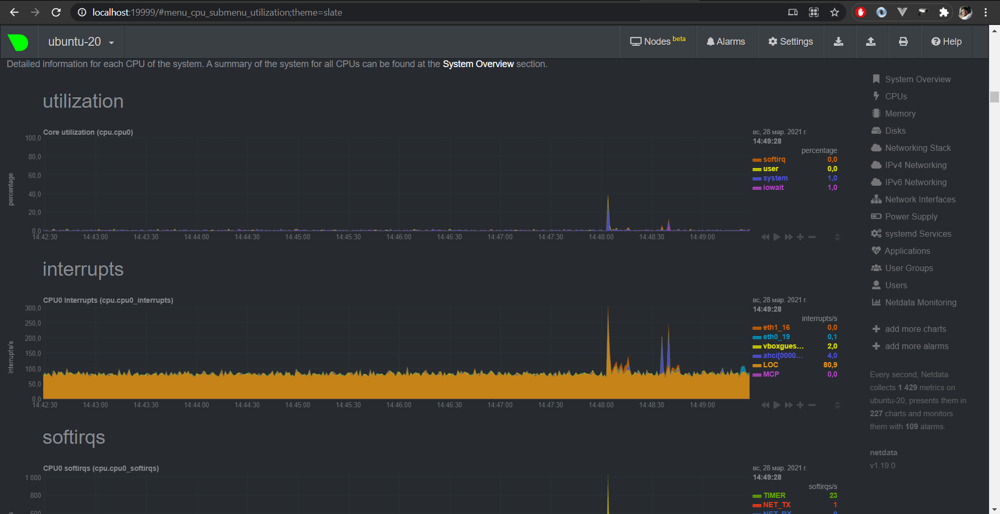
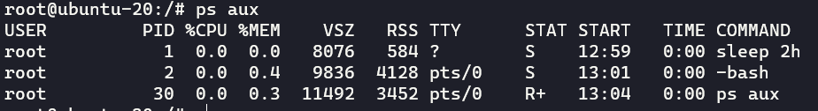
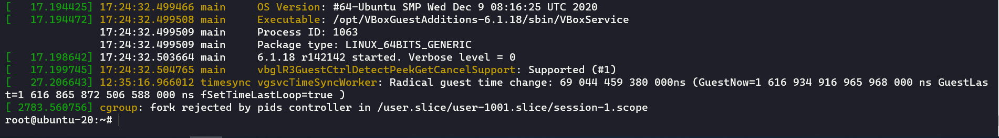

# Домашнее задание к занятию "3.4. Операционные системы, лекция 2"

1. Мною был скачан и распакован архив с `node_exporter` в директорию `/opt/node_exporter`, затем создан конфигурационный файл `/etc/systemd/system/nodex.service` следующего вида:

    ```ini
    [Unit]
    Description=Prometheus exporter for hardware and OS metrics exposed by *NIX kernels.
    After=network.target

    [Service]
    Type=simple
    WorkingDirectory=/opt/node_exporter
    EnvironmentFile=-/opt/node_exporter/.node_exporter
    ExecStart=/opt/node_exporter/node_exporter $EXTRA_OPTS
    KillMode=process
    KillSignal=SIGINT
    Restart=always
    RestartSec=10
    User=root
    Group=root

    [Install]
    WantedBy=multi-user.target
    ```

    Файл `/opt/node_exporter/.node_exporter` я использовал для передачи дополнительных опций запуска сервиса. Выполнил команду `systemctl daemon-reload`, для применения настроек и для добавления в автозагрузку сервиса выполнил `systemctl enable nodex` и для запуска `systemctl start nodex`

2. Опции для базового мониторинга `--collector.disable-defaults --collector.cpu --collector.cpufreq --collector.diskstats --collector.meminfo --collector.netstat`, параметр `--collector.disable-defaults` был использован, так как все метрики по-умолчанию включены

3. Netdata

    

4. Можно, это видно в самом начале вывода:

    ```
    ...
    [0.000000] DMI: innotek GmbH VirtualBox/VirtualBox, BIOS VirtualBox 12/01/2006
    [0.000000] Hypervisor detected: KVM
    ...
    ```
5. `fs.nr_open` - это системное значение в `sysctl`, его значение можно получить из `sysctl -n fs.nr_open` оно отвечает за кол-во открытых файлов на процесс, у `sysctl` это значение по-умолчанию равно `1048576`, но не смотря на это, данное значение не позволит достичь так называемое "мягкое" системное ограничение `open files` из команды `ulimit -a`, данное значение можно увеличить до максимального "жесткого" ограничения `ulimit -aH` так же равного `1048576`

6. Данную задачу можно выполнить спомощью команды `unshare` которая предназначена для запуска программ в отдельном пространстве имен отвязанном от родительского `unshare -f --pid --mount-proc sleep 2h`

   

7. `:(){ :|:& };:` - если разобрать данный код детально, то можно увидеть что в данном примере:

    ```bash
    :() { #Создается функция с именем ":"
        : | : & #Которая вызывает себя, передает stdout в stdin вызова себя же и уходит в фон
    };
    : #Вызывается функция с именем ":"
    ```

    проще говоря, это форкбомба, для большей читаемости можно написать так:

    ```bash
    my_func() {
        my_func | my_func &
    };
    my_func
    ```
    если запустить такую функцию, то она начнет порождать процессы до тех пор пока мы не уткнемся в ограничение `ulimit -u` кол-во процессов на пользователя, сообщение об этом можно увидеть в `dmesg`

    Fork rejected by pids controller

    

    Кол-во процессов на пользователя можно ограничить через `ulimit -u 10` или на постоянной основе через конфигурационный файл `/etc/security/limits.conf`


