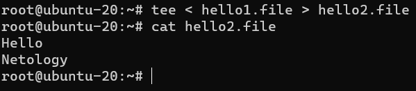
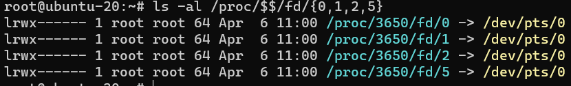
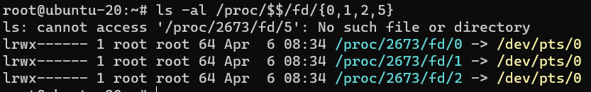
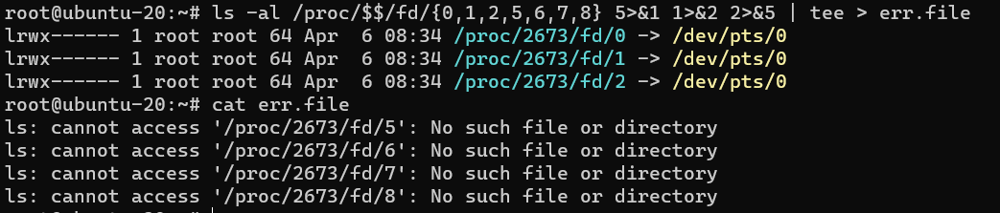

# Домашнее задание к занятию "3.2. Работа в терминале, лекция 2"

1. С помощью команды `type cd` можно узнать, что, `cd is a shell builtin` из чего можно понять что, `cd` это встроенная команда в `bash` для навигации по файловой системе
2. Альтернатива команде `grep <some_string> <some_file> | wc -l` без использования `pipe` это `grep` с параметром `-c`, например `grep -c <some_string> <some_file>`
3. Процесс с PID 1 это `systemd` - системный и сервисный менеджер, который создает и поддерживает все последующие службы
4. С помощью команды `tty` можно узнать ID выделенного нам псевдотерминала, таким образом можно перенаправлять потоки от одной сессии к другой (при наличии прав), например:

   <br/>
   1й терминал

   ```bash
   tty
   /dev/pts/0
   ```

   2й терминал

   ```bash
   tty
   /dev/pts/1
   ```

   Таким образом вывод из 1й сессии во 2ю можно сделать следующим образом

   ```bash
   ls /hothing 2> /dev/pts/1
   ```

5. Самый простой пример подобной операции это `tee < hello1.file > hello2.file`
   
6. Передать какие-либо данные в эмулятор `tty` можно с помощью например `echo "Hello world" > /dev/tty`. Сможем ли мы наблюдать выводимые данные будет зависеть от того в какой конкретно эмулятор мы передаем данные, например `/dev/tty` (виртуальное устройство консоли) ассоциирован c нашей консолью, своего рода UART, таким образом мы увидим выводимые данные
7. `bash 5>&1` запустит программу `bash` и создаст файл с дескриптором `5` который перенаправит в файл с дескриптором `1 (stdout)`

   

   таким образом команда `echo netology > /proc/$$/fd/5` выведет на экран командной оболочки `netology`, после чего можно выполнить `exit` и убедиться что в исходном экземпляре программы `bash` подобных перенаправлений нет

   

8. Пример замены стандартных потоков местами через промежуточный дескриптор `ls -al /proc/$$/fd/{0,1,2,5,6,7,8} 5>&1 1>&2 2>&5 | tee > err.file`. В данном примере мы создаем временный файл с дескриптором `5` и перенаправляем его в `stdout`, затем перенаправляем `stdout` в стандартный `stderr` и перенаправляем `stderr` в созданный нами временный дескриптор, таким образом получаем

   

    дополнительный временный дескриптор нужен для того, что бы не потерять данные, так как перенаправление потоков идет последовательно слева на право
9.  Команда `cat /proc/$$/environ` выведет переменные среды для текущей сессии, еще это можно узнать с помощью `env`
10. `/proc/<PID>/cmdline` - содержит полную командную строку для процесса, если только процесс не является зомби, иначе возвращает пустую строку. `/proc/<PID>/exe` - В Linux 2.2+ по этому пути содержится ссылка на фактически исполняемую команду, вызвав `/proc/<PID>/exe` можно запустить еще одну копию исполняемого файла, в Linux 2.0 и более ранних версиях содержал указатель на исполняемый двоичный файл в формате `[<major><minor>] <index>`, где `major` - это устройство (диск), `minor` - раздел на устройстве, `index` - индекс на данном устройстве, например `[0101]: 1111`
11. С помощью команды `cat /proc/cpuinfo | grep sse` можно получить всю информацию где содержится ключевое слово `sse` из чего можно сделать вывод, что самая старшая поодерживаемая версия инструкций SSE на моем процессоре это - [SSE-4.2](https://en.wikipedia.org/wiki/SSE4#SSE4.2)
12. Это происходит из-за того что при попытке выполнить команду `tty` удаленно через `SSH`, например `ssh localhost 'tty'`, `tty` не выделяется, для принудительного выделения `tty` необходимо использовать ключ `-t` в таком случае псевдотерминал выделится принудительно, даже если у текущего `SSH` его нет.

###

14. Команда `tee` из мануала `man tee`, читает из `STDIN` и пишет в `STDOUT`, таким образом пример `echo string | sudo tee /root/new_file` будет работать так как `shell` перенаправит поток в `STDIN` команды `tee` которой мы в свою очередь уже от `root` говорим писать в файл `/root/new_file`
