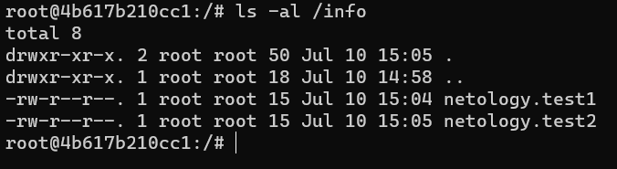

# Домашнее задание к занятию "5.3. Контейнеризация на примере Docker"

1. Сценарий:

   - Высоконагруженное монолитное java веб-приложение - я думаю что лучше подойдет физическая машина, в крайнем случае виртуальная, докер точно не подойдет, хотя бы потому что это выходит за рамки концепции докер 1 контейнер - 1 задача - 1 червис;
   - Go-микросервис для генерации отчетов - я думаю что докер прекрасно бы подошел, мы не выходим за рамки концепции, а если отчеты генерируются в базу или директорию с файлами, то всегда можно прикрутить докер сторадж или использовать базу на соседнем докере или виртуальной машине, зависит от загруженности;
   - Nodejs веб-приложение - если речь идет о полноценном приложении с бэкендом, фронтом и базой, то лучше использовать виртуальную машину, опять же с учетом нагруженности, если архитектура приложения позволяет, то можно разбить его на 3 части и держать на разных виртуальных машинах или контейнерах, если речь идет о легковесном приложении, то можно все развернуть в контейнере;
   - Мобильное приложение c версиями для Android и iOS - тут, я так понял речь идет о бэкенде, если это некое REST API, то можно держать в контейнерах удобно используя функционал версионирования;
   - База данных postgresql используемая, как кэш - так же как и во всех предыдущих примерах, все немного субъективно, если наш кэш `stateless`, то можно обойтись и докером, так же можно примонтировать директорию для базы данных при необходимости, если нагрузка на кэш большая, то подумать про размножение контейнеров и потоковую репликацию;
   - Шина данных на базе Apache Kafka - я к сожалению никогда не работал с Apache Kafka, я так понимаю что это брокер сообщений как RabbitMQ, думаю что вполне подойдет докер, опять же будет легко поднять кластер используя перед ним какой-либо оркестратор;
   - Очередь для Logstash на базе Redis - так же считаю что докер прекрасно бы подошел, т.к. Redis работает с данными в ОЗУ и лишь при перезапуске синхронизируется с диском, можем примонтировать ему диск, в то время как сам Redis будет рабоать с ОЗУ напрямую через ядро системы даже из докера;
   - Elastic stack для реализации логирования продуктивного веб-приложения - три ноды elasticsearch, два logstash и две ноды kibana - эластик достаточно требовательное к производительности системы творение, его бы я однозначно разворачивал бы на 3х отдельных физических машинах (или на виртуальных машинах с хорошим выделением ресурсов), что касается logstash и kibana, тут уже можно обойтись виртуальными машинами, а kibana на сколько я помню это просто вэб оболочка для визуального представления данных, она может и в докере работать без проблем;
   - Мониторинг-стек на базе prometheus и grafana - я думаю что в данном случае тоже подойдет докер, т.к. это системы сугубо для мониторинга, которые изначально не подразумевают большое число пользователей и высокую нагрузку на систему;
   - Mongodb, как основное хранилище данных для java-приложения - не очень знаком с MongoDB, но если java приложение высоконагружено, то лучше использовать железный сервер или виртуальную машину с хорошим запасом по ресурсам;
   - Jenkins-сервер - однозначно можно использовать докер, есть множество готовых образов, легко развернуть, легко настроить.

   p.s. В целом я считаю, что по всем вышеперечисленным пунктам решения могут быть сугубо субъективными, много зависит от общей инфраструктуры и иногда нет никакого смысла разворачивать докер ради докера и т.д.

2. [Dockerhub](https://hub.docker.com/r/develtime/httpd_netology)

   <br/>

   ```sh
   docker pull develtime/httpd_netology
   ```

   ```sh
   docker run --name test_httpd -p 80:80 -d develtime/httpd_netology
   ```

3. Общее хранилище для контейнеров

   <br/>

   Запуск контейнеров

   ```sh
   docker run --name test_centos -v /root/info:/share/info -dit centos
   ```

   ```sh
   docker run --name test_debian -v /root/info:/info -dit debian
   ```

   Подключаемся к образам

   ```sh
   docker exec -ti test_centos bash
   ```

   ```sh
   docker exec -ti test_debian bash
   ```

   Результат

   
