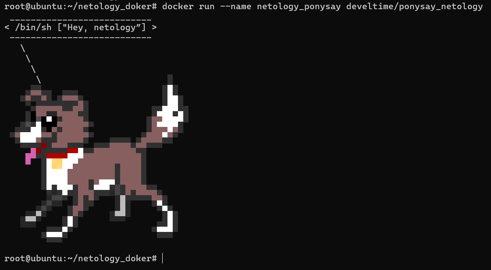
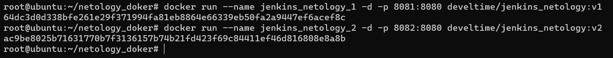
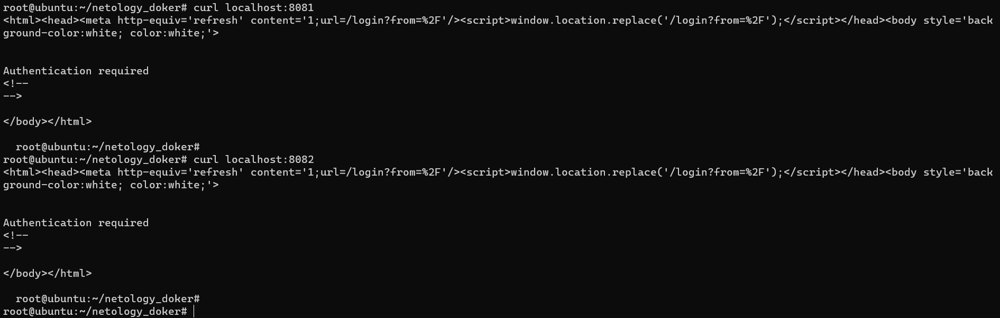
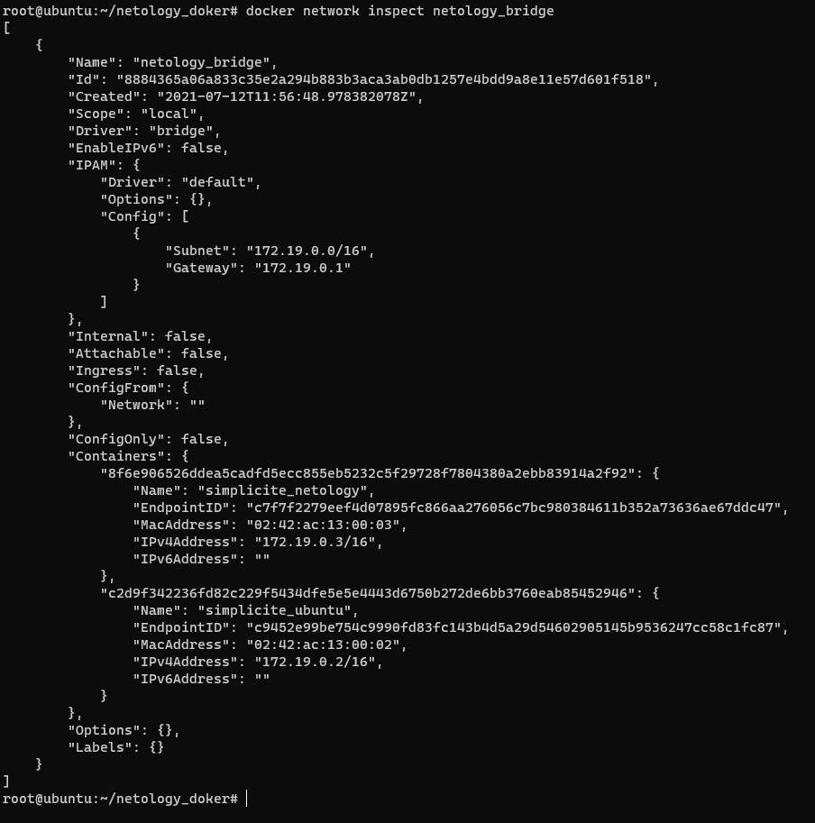
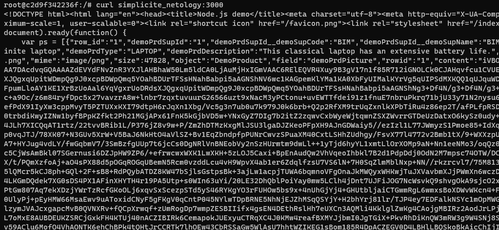

# Домашнее задание к занятию "5.4. Практические навыки работы с Docker"

1. [Ponysay netology](https://hub.docker.com/r/develtime/ponysay_netology)

   ```dockerfile
    FROM archlinux

    RUN pacman -Syy && \
        pacman -S ponysay --noconfirm

    ENTRYPOINT ["/usr/bin/ponysay"]

    CMD ["Hey, netology”]
   ```

   

2. [Jenkins netology](https://hub.docker.com/r/develtime/jenkins_netology)

   ```dockerfile
   FROM amazoncorretto

   RUN yum install wget -y

   RUN wget --no-check-certificate -O /etc/yum.repos.d/jenkins.repo https://pkg.jenkins.io/redhat-stable/jenkins.repo && \
       rpm --import https://pkg.jenkins.io/redhat-stable/jenkins.io.key && \
       yum upgrade -y

   RUN yum install jenkins -y

   ENTRYPOINT ["java","-jar","/usr/lib/jenkins/jenkins.war"]
   ```

   ```dockerfile
   FROM ubuntu:latest

   RUN apt-get update -y

   RUN apt-get install wget -y

   RUN apt-get install software-properties-common -y

   RUN apt-get install openjdk-8-jdk -y

   RUN wget -q -O - https://pkg.jenkins.io/debian-stable/jenkins.io.key | apt-key add - && \
       echo 'deb https://pkg.jenkins.io/debian-stable binary/' > /etc/apt/sources.list.d/jenkins.list && \
       apt-get update -y && apt-get install jenkins -y

   ENTRYPOINT ["java","-jar","/usr/share/jenkins/jenkins.war"]
   ```

   <br/>

   
   <br/>

   

3. Docker network

   Dockerfiles:

   ```dockerfile
   FROM node:14.17.3-alpine3.14

   RUN apk add git curl

   WORKDIR /var/www/simplicite/

   RUN git clone https://github.com/simplicitesoftware/nodejs-demo.git .

   RUN npm install

   ENTRYPOINT ["node", "app.js", "0.0.0.0", "3000"]
   ```

   ```dockerfile
   FROM ubuntu:latest

   RUN apt-get update -y

   RUN apt-get install curl -y
   ```

   Сборка и запуск:

   ```bash
    $ docker build -t develtime/simplicite_netology -f Dockerfile_nodejs .
    $ docker build -t develtime/simplicite_ubuntu -f Dockerfile_ubuntu .
    $ docker network create -d bridge netology_bridge
    $ docker run --name simplicite_netology -d -p 3000:3000 --network netology_bridge develtime/simplicite_netology:latest
    $ docker run --name simplicite_ubuntu -dit --network netology_bridge develtime/simplicite_ubuntu:latest
   ```

   

   Проверка:

   ```bash
   $ docker exec -ti simplicite_ubuntu bash
   ```

   ```bash
   $ curl simplicite_netology:3000
   ```

   
